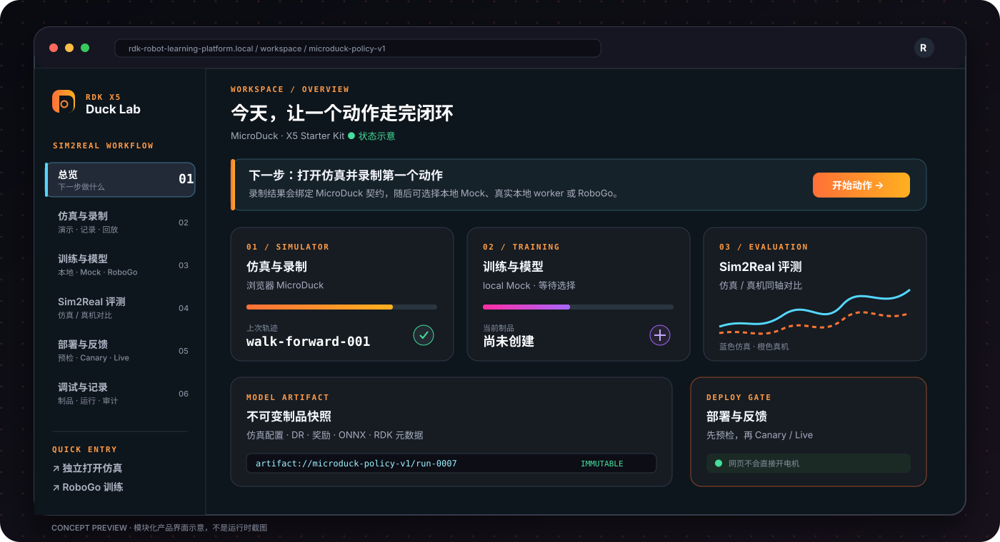

# RDK Robot Learning Platform

<div align="center">

**从浏览器里的第一步，到 RDK-X5 上的下一步。**

面向 MicroDuck 与 RDK-X5 的机器人学习工作台：仿真、录制、训练、评测、部署和虚实迭代，都围绕同一份可追溯模型契约组织。

**English (short version)** — A web-based robot learning workbench for MicroDuck and RDK-X5,
covering simulation, trajectory recording, training, telemetry evaluation, and controlled deployment.
Local engines include PPO, MLP behavior cloning, and ACT action chunking with numerical ONNX export
checks. The default Mock workflow needs no GPU; real training requires the selected engine's Python
dependencies. ACT accepts recorded episodes through its CLI; its worker integration currently runs
on synthetic smoke data. Board deployment requires hardware integration and release evidence.
See the quick start below and the [documentation index](docs/README.md).

[](https://github.com/D-Robotics/robot-learning-platform/actions/workflows/verify.yml)
[](https://nodejs.org/)
[](docs/api/openapi.yaml)
[](#30-秒上手)


</div>

> **一句话理解：这不是一个只能“遛鸭”的游戏。** 浏览器仿真是低门槛的动作入口；录制结果进入统一契约，随后可以交给本地 worker（默认 Mock）或 RoboGo adapter，最后通过制品、评测和 RDK-X5 预检进入受控的真机迭代。

Node.js 需要 `^22.22.2 || ^24.15.0 || >=26.0.0`（与 `package.json` 的 `engines` 以及 `.nvmrc` 一致）。下界由工具链本身决定：`jsdom@30` 要求 `^22.22.2 || ^24.15.0 || >=26`，高于 `vitest@5` 的 `^22.12.0 || ^24.0.0 || >=26`。Node 20 不提供 DSH 会话持久化依赖的 `node:zlib` zstd API；Node 23、25 等非 LTS 奇数版本也不在支持范围内。

> 当前版本是可公开审阅的独立产品源代码与参考实现。默认可以用本地 Mock worker 验证“仿真 → 训练请求 → 运行台账 → 遥测评测”流程；真实 RoboGo、RDK-X5 板端 agent、SSO/OIDC 与 OTA 由部署方通过 adapter 注入，仓库不包含任何账号、密钥或设备地址。

## 先看懂平台

| 你想做什么 | 从哪里开始 | 结果是什么 |
| --- | --- | --- |
| 亲手演示一个动作 | **仿真与录制** | 浏览器轨迹 JSON / JSONL |
| 训练一个策略 | **强化学习训练** | 本地 Mock、本地 worker 或 RoboGo Run |
| 判断仿真是否接近真机 | **Sim2Real 评测** | 遥测、回放和虚实偏差摘要 |
| 给 X5 做上线准备 | **部署与反馈** | 契约、板型、制品和只读预检 |

平台把“可视化入口”和“受控执行”分开：浏览器负责观察和录制，服务端负责权限、制品、幂等和审计，板端/云端 adapter 负责真正的训练或部署。

产品定位、同类能力对标和当前成熟度判断见 [`docs/product-maturity-plan.md`](docs/product-maturity-plan.md)。一句话概括：这是 **RDK 机器人策略的证据链与安全交付控制面**，重点是把 Run、制品、评测、板型预检和人工审批连成可审计发布链。

### 工作台更新

- **训练配置**：引擎能力说明、训练设置与续训参数分组；可选引擎需由 worker 显式注册。
- **遥测回放**：统一时间轴联动奖励曲线、观测/动作热图，支持逐帧检查。
- **数据体检**：展示 episode 长度分布与离群提示；无数据时提供导入指引。
- **部署判断**：汇总可用板卡，并按原因折叠展示不兼容项。

### 训练路径与引擎

| 路径 | 适合谁 | 当前仓库能验证什么 | 生产接入点 |
| --- | --- | --- | --- |
| **本地 / Mock** | 没有 CUDA、先验证产品和协议 | 任务台账、状态流转、遥测、评测、回放 | `LocalRunnerPort` |
| **本地 / starter-ppo** | 无 GPU 但要看真实训练 | `mock=false` 的真 PPO、ONNX 导出、遥测评测（`npm run demo:starter`） | `engines/starter-ppo` |
| **本地 / MJX** | 要真 MuJoCo 接触动力学（CPU 即可） | 真 MuJoCo 物理 + 纯 JAX PPO + ONNX/质量门证据（`npm run verify:mjx-adapter`） | `engines/mjx-adapter` |
| **本地 / 视觉观测** | 要「顶置相机像素 → 策略」端到端 | 纯 JAX PPO + ONNX 导出 ≡ JAX 前向（`npm run verify:vision-observation`） | `engines/visual-ppo` |
| **本地 / dm_control** | 要 DeepMind 生态 env API | dm_control `rl.control.Environment` + 同一 MJCF 物理（`npm run verify:dm-control-adapter`） | `engines/dm-control-adapter` |
| **本地 / 行为克隆** | 有示教/录制数据，想直接克隆策略 | 真 MLP BC + train/val 分离 + ONNX 数值等价证明（`npm run verify:offline-bc`） | `engines/offline-bc` |
| **本地 / ACT 分块模仿** | 有带 episode 边界的示教轨迹，想训练动作分块策略 | 真 ACT（Zhao et al. 2023）：Transformer 编解码 + CVAE 隐变量 + k 步动作分块 + 时序集成，episode 级 train/val 划分，ONNX 与 torch 前向数值等价（`npm run verify:act`） | `engines/act` |
| **RoboGo** | 有云端算力和训练账号 | manifest 校验、请求边界、token 不出浏览器、状态 reconcile | `RoboGoRunnerPort` |

Mock 的 `completed` 只表示协议演练完成，不代表真实 PPO 权重或可部署模型；真实训练必须由已配置的 runner 明确返回制品。starter-ppo 返回的是真实训练产物（`mock=false`），但其 numpy 物理不是 MicroDuck 全身动力学；MJX 引擎跑真 MuJoCo 接触动力学（台账标注 `physicsBackend=mjx`）；dm_control 适配器跑同一 MJCF 物理但经 DeepMind 生态 env API（`physicsBackend=dm-control-mujoco`）；视觉训练引擎吃顶置相机像素观测（`physicsBackend=cpu-mujoco-vision`）。所有本地引擎 `deployable` 恒为 `false`。

### 当前能力边界

| 能力 | 状态 | 说明 |
| --- | --- | --- |
| 浏览器 MicroDuck + 中文控制层 | ✅ | 上游资源需由部署方挂载；仓库不重新分发上游 bundle |
| 动作录制、契约校验、JSONL 导入 | ✅ | 可在本地直接验收 |
| 本地 Mock 闭环 | ✅ | 无 CUDA 可跑通 API 和 UI 流程 |
| **CPU 真实 PPO 训练（starter-ppo）** | ✅ | `npm run demo:starter`：真训练 + 真 ONNX + 遥测评测，无 GPU 依赖 |
| **视觉观测训练（顶置相机像素 → 策略）** | ✅ | `engines/visual-ppo`：真 JAX PPO 吃 64×64 顶置相机渲染 + 板载 8D 混合观测，ONNX 导出与 JAX 前向数值等价，`npm run verify:vision-observation` |
| **ACT 动作分块模仿** | ✅ 本地训练 / 🟡 Worker 冒烟 | Transformer + CVAE 隐变量、episode 级训练/验证划分、动作分块与时序集成；ONNX 导出带数值等价检查。CLI 接受真实轨迹，worker 当前使用合成示教数据；不代表真机动作效果或上板就绪。见 [ACT 使用说明](docs/engines/act.md) |
| **物理级域随机化（质量/摩擦/执行器）** | ✅ | MJX 引擎任务包契约新增 `physicalDomainRandomization`（轮摩擦、底盘质量、伺服 kv 按 episode 重采样并进入 vmap 轨迹），`npm run verify:mjx-adapter` 实证质量被真实改变 |
| **dm_control 生态适配** | ✅ | `engines/dm-control-adapter`：dm_control 1.x `rl.control.Environment`/`Task` 钩子 + 与 MJX 同源 MJCF 物理，`npm run verify:dm-control-adapter`；Playground 侧如实结论见 [docs/engines/dm-control-adapter.md](docs/engines/dm-control-adapter.md) |
| **MJX 引擎（MuJoCo 接触动力学，纯 JAX）** | ✅ | `npm run verify:mjx-adapter`：真 MJX 物理 + 纯 JAX PPO + 质量门证据，本机 CPU 可验证（无 jax 时 SKIP）；GPU 按 profile 放大吞吐。见 [docs/engines/mjx-adapter.md](docs/engines/mjx-adapter.md) |
| **mujoco-web 部署方模型注册表** | ✅ | 受审 MJCF 白名单 + 启动时真实编译 fail-closed（`npm run verify:mujoco-models`）；不开放任意上传 |
| mjlab + rsl-rl GPU 训练 | 🔌 | 参考适配器在 `engines/mjlab-rsl-rl-adapter/`：rsl-rl `OnPolicyRunner` 真跑 2 迭代（`npm run verify:mjlab-adapter`，CPU 可验证），mjlab GPU 物理侧需自备 GPU 训练栈；物理级 DR 与 dm_control 生态接入已补齐见上表 |
| RoboGo 适配接口 | 🔌 | 需要服务端配置真实地址、凭据和网络策略 |
| RDK-X5 真机采集 / BoardAgent / OTA | 🧩 | 提供端口、预检和部署边界，需接入实际设备 |
| 真机遥测（IMU/里程计/电池） | 🟡 参考实现 | 常驻只读遥测节点 + 认证代理 + 评估页同屏对比已具备；参考机型 OriginBot 的现场证据需按发布清单归档 |
| 真机受限驱动（运动金丝雀） | 🧩 代码门禁已具备 | 通用 `/cmd_vel` 通道默认关闭，含双开关 + 双重钳制 + 时间盒 + 急停恒可用；真实运动验收见 [docs/actuator-drive.md](docs/actuator-drive.md) |
| 板端延迟 rehearsal（上板时序证据） | 🧩 代码门禁已具备 | `services/sim2real-web/board-latency-rehearsal.py` 复用真实 runtime 加载路径在板上采样，产出 `board-onnx` 收据；`validateArtifactForDeployment` 对**声称可部署**的制品强制要求新鲜、同字节、达标且自洽的收据，训练主机的 `host-torch` 数字不再能替代它。探针与门禁一致性见 `npm run verify:board-latency`；**收据自动入库与真实 X5 测量待现场验收**，见 [docs/host-station.md](docs/host-station.md) |
| 生产加固（CSP / 限流 / 结构化日志 / 指标） | ✅ | 自家页面严格 `script-src 'self'`、进程内限流 429、JSON 行日志、Prometheus `/metrics`；MicroDuck 上游 bundle 所在的 `/mujoco` 刻意放宽，见 [docs/operations.md](docs/operations.md) |
| 遥测有界读 + 保留策略 | ✅ | 小 `limit` 的遥测列表不再解析整个分片；可按天淘汰过期遥测（默认关闭），见 [docs/scalability.md](docs/scalability.md) |
| 多实例部署 | 🟡 部分 | **1 写 + N 只读副本**：写者持文件租约，第二个写者 fail-fast；只读副本用 `RDK_SIM2REAL_STORAGE_READ_ONLY=1` 安全扩读。多写者仍需 PostgreSQL + 对象存储，见 [docs/scalability.md](docs/scalability.md) |

<div align="center">



<sub>模块化工作台概念图：展示产品信息架构与数据关系，不是运行时截图。</sub>

</div>

## 30 秒上手

```bash
npm ci
cp .env.example .env

# 终端 1：无 CUDA 的流程演练 worker
npm run dev:mock-worker

# 终端 2：独立 Web 工作台
npm run dev:sim2real
```

想要**真实训练闭环**（真 PPO + ONNX 制品 + 遥测评测，约 2 分钟笔记本 CPU）：

```bash
python3 -m pip install --user numpy torch onnx
npm run demo:starter
```

有示教数据时，可以单独运行 ACT（Python 环境需安装 `numpy`、`torch`、`onnx`、`onnxruntime`；锁定依赖见 `engines/act/requirements.txt`）：

```bash
npm run train:act -- recordings.jsonl --out model.json --onnx policy.onnx --chunk 8
npm run verify:act
```

轨迹必须包含 episode 边界，并有足够回合用于训练/验证划分。可选的集成 ONNX 与延迟测量参数见
[ACT 使用说明](docs/engines/act.md)。训练主机的延迟结果不能替代 X5 板端测量。

先跑 `npm run doctor` 可以一键体检环境（Node/Python/ONNX/GPU/端口），每条失败项都带修复命令。

它会用 `engines/starter-ppo`（numpy 向量化物理 + torch PPO，**自动检测 CUDA**：有 GPU 就用 GPU，没有就 CPU 且如实上报 `result.cuda=false`）完成：注册 manifest → `mock=false` 的真实训练 → 导出 `policy.onnx` → 分块上传评测轨迹 → 对未训练基线出 MAE/RMSE 评测。依赖缺失时明确退出，不伪造训练结果；详见 [`docs/engines/starter-ppo.md`](docs/engines/starter-ppo.md)。有独立 GPU 机器时用 `node scripts/gpu-deploy.mjs` 一键部署（见 [`docs/gpu-runner.md`](docs/gpu-runner.md)）。生产级 GPU 训练（mjlab + rsl-rl）的接入参考在 `engines/mjlab-rsl-rl-adapter/`。

演示时也可以直接用一条命令启动隔离的 Mock worker、只读 reference BoardAgent 和 Web 工作台：

```bash
npm run demo:sim2real
```

它使用临时台账并预置一台 `x5-demo` 模拟板卡，退出后不会污染本地开发记录；因此可以把“生成预检计划 →
只读 BoardAgent → 安全闸门”完整走一遍。Mock 只演练协议和台账，reference BoardAgent 只做只读预检，
不会把部署标成真机就绪。需要展示 MicroDuck 浏览器场景时，仍需显式设置经过审核的
`RDK_SIM2REAL_MICRODUCK_ROOT` 或 `RDK_SIM2REAL_MICRODUCK_URL`，启动器不会自动下载上游资源。

需要演练部署页的只读 X5 预检时，再开 `npm run dev:board-agent`，并设置
`RDK_SIM2REAL_BOARD_AGENT_URL=http://127.0.0.1:19100`；该 reference agent 只返回模拟板卡信息，
不会连接设备、执行命令或开启电机。

同一进程也提供**设备上位机**协议（工作台「数据与工具 → 设备上位机」视图）：板卡实时状态心跳、板载相机
MJPEG 流与白名单只读命令，全部经 `/api/sim2real/board-station` 认证代理转发，浏览器不直连
agent，也不存在任何电机控制通道；详见 [`docs/host-station.md`](docs/host-station.md)。

打开 <http://127.0.0.1:18102/?demo=1>（启动器日志也会给出这个地址）。查询参数会固定 MicroDuck 和行走任务；
页面中的“仿真与录制”会打开已挂载的 MicroDuck 浏览器仿真；
干净源码 checkout 未包含上游静态 bundle，未配置 `RDK_SIM2REAL_MICRODUCK_ROOT` 或 URL 时会显示安装指引页。
“强化学习训练”可选择本地 Mock runner；“Sim2Real 评测”支持导入浏览器录制的 JSON/JSONL 并显式绑定到 Run；
“部署与反馈”只做契约、板型和只读预检，不会在网页层直接开启电机。

如果现场暂时没有可录制的 MicroDuck bundle，评测页可以点击“载入合成演示证据”继续展示上传和评测
流程；该证据固定为 MicroDuck 61D/14D 合成样例，不代表真实 X5 遥测。

运行确定性检查：

```bash
npm run verify
npx tsc --noEmit
npm run lint
npm run format:check
```

`npm test`（vitest）与 `npm run verify` 是两套互补的门禁：前者是单元/行为测试，后者串起契约与接线断言脚本、构建、API 契约核对和本地 smoke。`npm run verify:escape-audit` 扫描前端模板插值，禁止未转义的值进入 `innerHTML`。

`npm run verify:local-worker` 会用一个临时外部引擎验证真实 Worker 契约；
`npm run verify:board-agent` 会验证只读 BoardAgent、模拟标记和 token 闸门；
`npm run verify:api-contract` 会实例化真实路由工厂，双向核对 OpenAPI 契约与挂载端点
（spec 漂移或死契约都会失败），并验证 `/api/sim2real` 与 `/api/v1/duck` 别名路由集完全一致。
`npm run smoke:sim2real-local` 会临时启动 Web、local worker 和 reference BoardAgent，
实际走一遍 overview → 本地训练完成 → 幂等重放 → 模拟板卡预检拦截；它也已包含在 `npm run verify` 中。

## 目录

| 目录 | 内容 |
| --- | --- |
| `services/sim2real-web` | 独立 Web 入口、总览 + 四流程 + 两工具工作流 UI、Mock worker 与服务单元示例 |
| `services/mujoco-web` | MicroDuck 静态入口、中文交互覆盖层、社区二维码和浏览器轨迹录制 |
| `shared` | MicroDuck 61D observation / 14D action / 50 Hz 契约、模型制品和遥测类型 |
| `server/routes` | Sim2Real HTTP API（模型、运行、部署、遥测） |
| `server/sim2real` | 本地/RoboGo runner、JSON ledger、兼容性策略和可替换 adapter |
| `docs/api` | 版本化 OpenAPI 契约与外部集成调用顺序 |
| `docs/sim2real-plugins.md` | 事件驱动扩展层：实验追踪、对象存储、通知和硬件适配器 |
| `docs/assets` | README 首屏与工作台示意图（自绘 SVG，无运行时依赖） |
| `docs/design` | 产品设计、MVP/90 分验收、Sim2Real 方案和端到端流程 |

总览页还提供动态“研发闭环评分”，按契约、训练、评测、发布和项目血缘五项软件证据给出下一步建议；数据集可记录版本、SHA-256、契约和来源运行，详见 [`docs/dataset-lineage.md`](docs/dataset-lineage.md)。

## 训练与部署边界

- 本地 runner 与 RoboGo runner 使用同一份受控 manifest；请求只包含契约、训练 profile 和不透明 `artifact://` 引用，不执行任意 Python/XML/shell。
- 运控模型可声明 `runtime=cpu-onnx`、`workload=locomotion`、`threads=1`，在 X5 CPU 单线程推理；感知模型可继续使用 BPU，避免争抢控制循环。
- 普通 ONNX 只代表仿真/本地推理制品；上板必须提供匹配目标板型的 `.bin`/`.hbm` 编译制品和 runtime 元数据。
- 预检是只读的；Canary/Live 需要受控的 `BoardAgentPort` 与人工审批。平台不把 Mock 的 `completed` 当作真实 RL 或可部署模型。

## 多用户与 RoboGo

核心路由只依赖 `Sim2RealAuthPort`。公开仓库中的 standalone adapter 默认单用户、无身份推断；当前独立 systemd unit 固定使用签名 trusted-proxy 参考实现（不会直接解密 Studio Cookie）。若生产要直接接入 Studio SSO/OIDC，需先替换组合根 adapter 并审核对应 unit，再把 RoboGo token 作为服务端 secret 注入。绝不使用可被浏览器伪造的账号请求头；未配置认证的 web-cloud 进程会 fail closed。

为避免重复提交造成不可控的算力或费用，每个账号默认最多同时保留 4 个 queued/running 的本地或 RoboGo 任务（可用 `RDK_SIM2REAL_MAX_ACTIVE_RUNS` 调整，上限 100）。单用户模式可从 root-only 环境文件读取 `RDK_SIM2REAL_ROBOGO_TOKEN`；共享/trusted-proxy 模式会忽略全局令牌，只接受已验证网关按请求转发的短期令牌。
RoboGo 的资源探针只提供状态展示，不是训练提交的硬前置条件；trusted-proxy 网关可以仅在显式训练 POST 上转发短期令牌，探针暂时失败时页面仍交给服务端复核。服务端没有拿到当前账号授权时会将任务明确标记为 blocked，不会静默回退或启动计费任务。

单实例 JSON ledger 还限制 100 个自定义模型、10,000 个 run、200 个部署计划和 768 MiB 总大小；
达到记录数上限会明确返回 `507 SIM2REAL_LEDGER_QUOTA_EXCEEDED`；整个 ledger 字节上限返回
`507 SIM2REAL_STORAGE_QUOTA_EXCEEDED`，不会静默淘汰历史。若 runner 已受理但提交响应超时/连接断开，或进程在保存
`externalRunId` 前崩溃，服务会把结果视为未知并保留 queued 预留；确认 runner 归属后，可由同一账号通过
公共 API 使用版本化 `/api/v1/duck/...`（例如 `/api/v1/duck/runs/:id/reconcile`）；
现有 `/api/sim2real/...` 路径作为兼容别名保留。`runs/:id/reconcile` 只读查询并补回状态，不会重复启动任务；
没有 `externalRunId` 的崩溃窗口预留默认在 24 小时后、下一次提交训练时自动标记为终止并释放名额
（可用 `RDK_SIM2REAL_ACTIVE_RUN_TTL_SECONDS` 调整，范围 5 分钟至 7 天）；已经拿到
`externalRunId` 的真实 runner 任务不受这个 TTL 影响。以上是 MVP 保护阀，正式多人部署仍需
PostgreSQL、对象存储和租户配额服务。

## 上游与许可证

本项目以 **Apache-2.0** 发布，完整原文见根目录 [`LICENSE`](LICENSE)。第三方集成方向及其许可证边界记录在 [`THIRD_PARTY_NOTICES.md`](THIRD_PARTY_NOTICES.md)。

MicroDuck 浏览器资源的上游 commit、仓库和许可证边界记录在 [`services/mujoco-web/MICRODUCK-UPSTREAM.md`](services/mujoco-web/MICRODUCK-UPSTREAM.md)；仓库不重新分发上游静态 bundle。`LICENSE` 的 APPENDIX 保留上游占位符，版权主体写法由发布方确认，公开发布前请走一遍 [`docs/release-checklist.md`](docs/release-checklist.md)。

更多说明：

- [`docs/README.md`](docs/README.md)（文档索引）
- [`docs/user-guide.md`](docs/user-guide.md)（使用手册与最佳实践）
- [`docs/operations.md`](docs/operations.md)（生产环境变量、限流、CSP、日志与指标）
- [`docs/scalability.md`](docs/scalability.md)（存储容量边界与扩容路径）
- [`docs/release-checklist.md`](docs/release-checklist.md)（公开发布阻塞项）
- [`docs/demo-runbook.md`](docs/demo-runbook.md)
- [`docs/gpu-runner.md`](docs/gpu-runner.md)
- [`docs/host-station.md`](docs/host-station.md)
- [`services/sim2real-web/README.md`](services/sim2real-web/README.md)
- [`docs/design/sim2real-90-acceptance.md`](docs/design/sim2real-90-acceptance.md)
- [`docs/design/sim2real-mvp-guide.md`](docs/design/sim2real-mvp-guide.md)
- [`docs/design/rdk-duck-product-design.md`](docs/design/rdk-duck-product-design.md)
