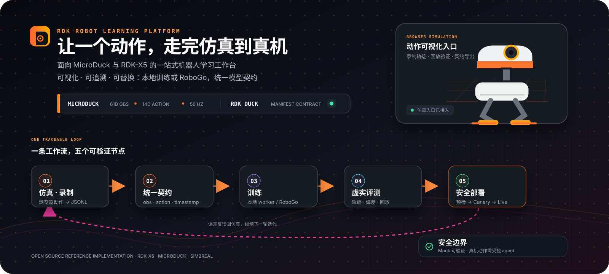

# RDK Duck Robot Learning Platform 产品文档

> 面向 RDK X5 与 RDK 自有 Duck 的机器人学习工作台：从动作设计、浏览器仿真、轨迹录制，到强化学习训练、遥测评测、板端预检和受控发布。



*图 1：平台围绕同一份模型契约组织完整的 Sim2Real 闭环。*

## 1. 产品概述

RDK Robot Learning Platform（RDK Duck Lab）是一个独立 Web 控制面。它把“一个动作任务”拆成可理解、可回放、可审计的步骤：选择 Duck 套件 → 登记契约 → 仿真与录制 → 训练与导出 → 评测与效果 → 预检与上板 → 看效果与回滚。

平台服务三类人：算法工程师管理模型、训练和指标；机器人工程师管理板卡、配件、遥测和运行时；平台运维管理账号、制品、配额、审计和生产部署。三类角色共享同一份项目、Run、Artifact 和 Evaluation 台账。

### 产品边界

- 浏览器负责仿真、交互、录制和回放。
- 服务端负责身份、权限、契约校验、幂等、配额和审计。
- Training Adapter 负责 Mock、本地 worker 或 RoboGo 训练。
- BoardAgent 负责板端探测、只读预检、遥测和经审批的 canary/live。
- 页面不会执行任意 Python/XML/shell，不会把 Mock 结果当成真实模型，也不会直接开启电机。

## 2. 产品定位与 RDK Duck 接入规划

当前平台是面向 RDK 自有 Duck 的通用学习与部署底座。仿真资源、机器人模型、动作空间、传感器和板端运行时均通过 profile 与 manifest 接入，平台不会把某个第三方机器人写死在业务流程中。OriginBot 作为独立的移动底盘产品线接入：它拥有自己的差速 adapter、8→2 目标导航契约、PPO 训练器和 X5 运行时；OriginBot 的真实结果仍不能直接代表 RDK Duck 的关节运动学、控制接口或评测结论。

后续接入 RDK Duck 时，建议按四步完成：

1. 新增 `rdk-duck` 产品与 hardware/accessory profile，声明关节、IMU、相机、电池和通信接口。
2. 提供 RDK Duck 仿真适配器与录制器，将观测/动作映射到统一 manifest。
3. 提供 X5 BoardAgent 适配器，完成 passport、只读预检、遥测和受限驱动。
4. 用真实 Duck 轨迹和 attested replay 建立评测基线，再开放 Canary/Live。

平台现有的项目、Run、Artifact、Evaluation、Deployment 和权限模型可以直接复用。

## 3. 信息架构与界面


*图 2：总览、六个业务模块和全局上下文共同构成工作台。*

顶部任务流始终显示“仿真与录制 → 训练与导出 → 评测与效果 → 预检与上板”；左侧模块导航提供独立入口。上下文条统一保存产品线、动作任务、当前模型、目标设备和账号状态，页面之间通过 `projectId / modelId / deviceId` 传递状态。

| 编号 | 模块 | 主要能力 | 典型产出 |
|---|---|---|---|
| 00 | 总览 | 集成健康度、当前阶段、下一步建议 | 工作流状态 |
| 01 | 仿真与录制 | RDK Duck 仿真、键盘/按钮控制、轨迹录制和回放 | JSON/JSONL 轨迹 |
| 02 | 训练与模型 | 选择后端、训练档位、续训、查看指标 | Run、checkpoint、ONNX |
| 03 | 评测与效果 | 导入遥测、仿真/真机对比、回放摘要 | MAE/RMSE、成功率、跌倒率 |
| 04 | 部署到 X5 | 设备选择、板型探测、预检和发布闸门 | Preflight、Canary 计划 |
| 05 | 记录与版本 | Runs、制品、发布、遥测的筛选和审计 | 可追溯记录 |
| 06 | 上位机 | CPU/内存/网络/电源、相机流、白名单只读命令 | 状态心跳、MJPEG |
| 07 | 套件与契约 | 登记 DuckKit、manifest、配件和契约检查 | 版本化模型契约 |

## 4. 核心对象与数据关系

```text
Account → Project → DuckKit → ActionTask
                           ├─ Trajectory
                           ├─ TrainingRun → Artifact
                           ├─ Evaluation
                           └─ Deployment → Preflight / Canary / Live
```

MVP 使用 SSO `accountId` 隔离资源；团队版可扩展为 Project + Membership（owner/editor/viewer）。前端不自行判断权限，服务端统一裁决。

### Manifest 契约

每个模型版本必须声明产品标识、观测布局、动作布局、控制频率、运行时、目标板型、制品引用和校验和。RDK Duck 参考契约是 **61D observation → 14D action，50 Hz**。策略制品使用不透明 `artifact://` 引用；普通 ONNX 只代表仿真/本地路径，上板必须提供匹配 X5 的编译制品和 runtime 元数据。

## 5. 端到端使用流程

### 4.1 登记套件与模型

选择 RDK Duck 产品线，载入模板或导入 manifest JSON，运行契约检查，再登记模型版本。平台只保存元数据和哈希，不执行上传内容。检查项包括维度顺序、形状、频率、运行时分工和制品来源。

### 4.2 仿真与录制

在 01 仿真页打开已审核的 RDK Duck 仿真资源包；使用键盘、移动端按钮或手柄控制动作。录制器按 50 Hz 保存观测、动作和时间戳，停止后导出 JSONL，可在评测页本地预览、检查采样率和跌倒事件，再绑定到指定 Run。

### 4.3 训练与续训

训练后端明确选择本地、Mock 或 RoboGo，平台不会静默 fallback。支持 `smoke`、`low-vram`、`standard`、`high-vram` 四档，归一化 `numEnvs`、`maxIterations` 和 `video`。续训必须指定 `resumeFrom.checkpointId` 与受控 artifact 引用，避免并行任务恢复到错误 checkpoint。

- Mock：验证协议、台账和 UI；结果永远标记为演示，不可部署。
- starter-ppo：CPU 可运行真实 PPO、导出 ONNX 并回写指标；当前物理环境是参考实现，`deployable=false`。
- RoboGo：服务端提交受控 manifest，token 只在服务端短时使用，不进入浏览器、URL 或日志。

Run 状态为 `queued → running → completed/failed`。提交超时或连接断开时保留 `outcome unknown`，重试不会重复启动；可通过 reconcile 只读查询并补回外部运行 ID。

### 4.4 评测与效果

评测页先在浏览器本地聚合遥测，用户点击“上传到当前 Run 并评测”后才分块写入台账。页面展示契约状态、成功率、跌倒率、控制延迟、奖励曲线、观测/动作热力图和仿真/真机差异。合成演示证据会持久化 `source=demo-fixture`，不能解锁真实评测或发布。

### 4.5 部署与 X5 预检

部署流程依次经过四道闸门：契约通过、评测与板端预检、无电机 Canary、人工批准 Live。用户先选择设备、探测板型、生成预检计划，再执行只读预检。预检读取架构、系统目录、磁盘、runtime 和设备能力，不下发模型、不启动节点、不驱动电机。Mock、合成证据、板型不匹配或缺少 attested replay 时保持 blocked。

### 4.6 上位机与受限驱动

上位机视图通过服务端认证代理读取板卡心跳、相机 MJPEG 和白名单只读命令；浏览器不直连 agent。电机控制默认关闭，只有平台和板端双开关同时开启后才出现受限驱动面板，并强制速度上限、单命令时间盒、双重钳制和急停。

## 6. 安全、权限与可靠性

认证可接 RDK Studio SSO 的 OIDC 或签名 trusted-proxy；共享部署未登录直接 401。账号、模型、Run、部署和遥测按稳定 `accountId` 隔离。训练请求只接受白名单字段和不透明制品引用，禁止把用户字段拼入 shell。

单实例 JSON ledger 默认限制：每账号最多 4 个 queued/running 训练、最多 100 个模型、10,000 个 Run、200 个部署计划和 768 MiB 总容量；遥测按 Run/账号设置样本和字节上限，超限返回 413/507，不静默删除历史。生产多副本应迁移 PostgreSQL、对象存储和独立配额服务。

任何失败都停在原状态并显示原因、修复动作和重试入口。没有 RDK Duck 仿真资源包 时服务标记 degraded；通过 `RDK_SIM2REAL_REQUIRE_DUCK_SIM=1` 可将其设为就绪硬依赖。

## 7. 本地启动与生产接入

### 本地演示

```bash
npm ci
cp .env.example .env
npm run demo:sim2real
# http://127.0.0.1:18102/?demo=1
```

真实 CPU PPO：

```bash
python3 -m pip install --user numpy torch onnx
npm run demo:starter
```

确定性检查：`npm run verify`、`npx tsc --noEmit`、`npm run smoke:sim2real-local`。

### 生产部署要点

构建 `dist-server`，使用专用 `sim2real` 用户和 root-only 环境文件；配置 `NODE_ENV=production`、`RDK_SIM2REAL_DEPLOYMENT=web-cloud`、认证 adapter、绝对台账目录和固定端口。通过 systemd 管理服务，Nginx 发布 `/sim2real/`，再用 `/healthz` 与 `/readyz` 验证。RDK Duck 可自包含挂载，也可通过受信 HTTPS URL 外置部署。

## 8. API 与集成

长期 API 命名空间是 `/api/v1/duck/...`，覆盖 projects、kits、tasks、trajectories、runs、artifacts、evaluations、devices、deployments 和 events；`/api/sim2real/...` 为兼容别名。MCP 只投影高层动作，如 `create_task`、`submit_training`、`get_run_status`、`validate_artifact` 和 `preflight_device`；危险动作必须经过 Execute 阶段和人工批准。

## 9. 验收标准

- 能从 manifest 登记开始完成仿真、录制、训练请求、遥测上传和评测回放。
- Mock 与合成证据始终带明确标签，不能生成可部署结论。
- 断线重试不会重复创建外部训练任务。
- 板型不匹配、契约不一致、预检失败和未认证请求全部 fail-closed。
- 预检只读；Canary/Live 具备人工批准、时间盒和急停。
- `/healthz`、`/readyz`、API 契约和 UI 自动化检查通过。

## 10. 相关资料

- 使用手册：`docs/user-guide.md`
- API：`docs/api/openapi.yaml`、`docs/api/README.md`
- 上位机：`docs/host-station.md`
- 受限驱动：`docs/actuator-drive.md`
- GPU 训练：`docs/gpu-runner.md`
- 演示脚本：`docs/demo-runbook.md`

## 11. 功能操作手册与最佳实践

### 10.1 总览

**怎么使用**：登录后先在上下文条选择项目、产品线、动作任务、模型和目标设备；查看四阶段状态卡，点击“下一步”进入当前最早可执行的模块；需要现场讲解时打开“演示视图”。

**最佳实践**：每次只推进一个动作任务；演示前使用 `?demo=1` 固定上下文；状态卡变红时先刷新，再检查 `/healthz`，不要直接重复提交训练。

**完成标准**：上下文完整、下一步建议明确、服务连接状态为就绪。

### 10.2 套件与契约

**怎么使用**：进入“套件与契约”→选择 RDK Duck→载入模板/导入 manifest→执行“校验清单”→确认观测、动作、频率和运行时→登记版本。导入制品时同时记录 artifact 引用和校验和。

**最佳实践**：模型名包含任务、环境数和迭代数；修改输入输出时新建版本，不覆盖旧版本；运控模型固定 `cpu-onnx + threads=1`，感知模型单独声明 BPU 制品。

**常见问题**：维度不一致通常来自动作顺序变化；普通 ONNX 不能直接作为 X5 上板制品；缺少校验和的制品不能进入预检。

**完成标准**：manifest 校验通过、版本已登记、制品引用可追溯。

### 10.3 仿真与录制

**怎么使用**：进入“仿真与录制”→打开已挂载的 RDK Duck 仿真→按动作说明操作→点击开始录制→完成动作后停止→下载 JSONL→在页面回放确认轨迹。

**最佳实践**：先用短轨迹验证动作，再录制正式数据；每条轨迹只包含一个目标动作；录制前确认控制频率为 50 Hz；导出后立即检查时间戳、观测长度和动作范围。

**常见问题**：画面空白表示 bundle 未挂载或 URL 不受信任；录制文件为空时检查浏览器焦点和开始/停止状态；不要把手工录制直接当作真实 X5 证据。

**完成标准**：轨迹可回放、采样率正确、数据无缺失、来源标签明确。

### 10.4 训练与模型

**怎么使用**：进入“训练与模型”→选择已登记模型→选择 Local、Mock 或 RoboGo→选择 smoke/low-vram/standard/high-vram→确认环境数和最大迭代→发起训练→在 Run 卡片查看排队、运行和完成状态→打开详情下载 checkpoint 或 ONNX。

**最佳实践**：先跑 smoke 验证契约和台账，再提高规模；调参使用“续训”并明确选择 checkpoint；一次只改变一个超参数；真实训练结果必须包含 artifact 引用和指标。

**常见问题**：按钮不可用通常是模型未选或 runner 未配置；任务超时不要立即重提，先查看 outcome unknown 并执行 reconcile；Mock completed 只是协议演练，不代表策略有效。

**完成标准**：Run 状态为 completed、指标来源明确、制品引用可访问、deployable 标志与事实一致。

### 10.5 评测与效果

**怎么使用**：进入“评测与效果”→选择 Run→导入浏览器或 X5 JSON/JSONL 遥测→本地检查采样率和事件→查看奖励曲线、成功率、跌倒率、延迟和资源占用→点击“上传到当前 Run 并评测”→生成对比摘要。

**最佳实践**：先本地查看再上传；仿真和真机使用相同动作任务与指标定义；报告中记录固件、模型版本、板型和采样时间；对外发布只使用真实 worker 或 attested replay。

**常见问题**：指标显示“—”表示没有真实证据，不要用默认值填充；合成演示证据会被标记为 demo-fixture；超出配额时先拆分文件或迁移对象存储。

**完成标准**：遥测绑定到具体 Run、来源已验证、对比指标可复现、评测结论可审计。

### 10.6 部署到 X5

**怎么使用**：进入“部署到 X5”→选择目标设备→点击“探测板型”→确认设备 passport→生成预检计划→执行只读预检→查看契约、runtime、磁盘和设备能力→预检通过后创建 Canary 计划→人工批准后进入 Live。

**最佳实践**：预检前锁定模型版本和目标板；先无电机 Canary，再做受限运动；保留急停和回滚路径；任何 blocked 状态先修复原因，不绕过闸门。

**常见问题**：板型不匹配需要重新编译目标制品；预检 401 表示 agent 认证失败；Mock/合成证据不能解锁发布；RDK Duck 未挂载不影响控制面预检，但可按配置设为硬依赖。

**完成标准**：预检结果通过、制品与板型匹配、Canary 日志干净、Live 具备人工批准和回滚点。

### 10.7 记录与版本

**怎么使用**：进入“记录与版本”→按 Runs、制品、发布或遥测筛选→按模型名、任务名或 Run ID 搜索→打开详情查看指标卡、原始 JSON、来源和时间线→将关键版本链接到评测报告。

**最佳实践**：采用统一命名，例如 `walk-ppo-1024env-ep300`；不要删除失败记录；每次发布关联 manifest、checkpoint、评测和预检；定期导出台账摘要。

**完成标准**：任何一次训练或发布都能回答“用了什么模型、在哪台设备、依据是什么、谁批准”。

### 10.8 上位机

**怎么使用**：进入“上位机”→选择已登记设备→查看 CPU、内存、网络、电源、磁盘和运行时长→打开相机 MJPEG→执行白名单只读命令→查看串流日志和真机遥测。

**最佳实践**：先确认 agent 心跳再执行命令；相机流用于观察和取证，不作为未经验证的评测数据；生产环境使用 HTTPS、短期 token 和独立执行策略；电机控制保持关闭，只有明确的运动金丝雀才临时启用。

**常见问题**：无数据时检查 `RDK_SIM2REAL_BOARD_AGENT_URL` 和 agent token；相机打不开时检查设备占用；日志中出现未知命令说明调用未经过白名单。

**完成标准**：设备状态新鲜、命令均有审计记录、相机和遥测来源明确、急停可用。

### 10.9 训练后端与配额管理

**怎么使用**：管理员在环境文件中配置 Local Runner、RoboGo Runner 或 BoardAgent 地址；启动服务后检查 `/healthz` 和 `/readyz`；通过运行台账观察并发、队列和存储使用量。

**最佳实践**：单 GPU 主机将本地 worker 并发保持为 1；训练执行文件使用绝对路径和固定参数数组；secret 只放 root-only 环境文件；生产多副本前先完成数据库、对象存储和分布式锁迁移。

**完成标准**：runner 配置通过健康检查、并发受控、超额请求明确失败、服务重启不会重复启动任务。

### 10.10 故障排查顺序

1. 查看页面顶栏连接状态并刷新。
2. 请求 `/healthz`、`/readyz`，确认服务和认证状态。
3. 打开对应 Run 或 Deployment 详情，读取失败原因和原始 JSON。
4. 检查模型契约、artifact 引用、板型 passport 和 agent 心跳。
5. 对未知训练任务执行 reconcile；确认归属前不要重试。
6. 修复后只重跑当前模块，并在记录页确认新旧版本关系。

## 12. 交付检查清单

- [ ] 项目、任务、模型、设备上下文已选择。
- [ ] Manifest 校验通过并登记版本。
- [ ] 仿真轨迹可回放，50 Hz 数据完整。
- [ ] 训练 Run 有明确后端、状态和制品。
- [ ] 评测遥测已绑定 Run，来源真实可追溯。
- [ ] X5 板型、runtime 和制品匹配。
- [ ] 只读预检通过，Canary 有日志和急停。
- [ ] Live 经过人工批准，并保留回滚版本。

## 13. OriginBot 现场演示方案

OriginBot 适合演示平台的移动机器人能力：设备接入、状态监控、IMU/里程计/电池遥测、相机流、只读预检、训练 Run、评测台账和受限 `/cmd_vel` Canary。OriginBot 不需要伪装成 RDK Duck；演示时应选择 OriginBot 差速底盘 profile，使用底盘观测/动作映射。

### 现场准备

1. RDK X5 上启动 OriginBot bringup，确认 `/imu`、`/odom`、`/originbot_status` 和 `/cmd_vel` 存在。
2. 启动板端 agent 和只读遥测节点，配置 `RDK_SIM2REAL_BOARD_AGENT_URL` 与 token。
3. 在平台登记 `rdk-x5-originbot-real` 设备并执行探测板型。
4. 将动作任务命名为“OriginBot 差速移动”，不要使用 Duck 关节动作名称。
5. 准备一份 OriginBot 遥测 JSONL；演示数据必须标记来源和是否真实。

### 推荐演示顺序

先展示总览和设备心跳，再打开上位机的 IMU、电池、里程计和相机；随后导入遥测并生成评测摘要。训练部分使用 Mock 或 Starter PPO 演示 Run 状态和制品流转；部署部分执行只读预检，最后在现场安全条件满足时演示低速、短时间的 `/cmd_vel` Canary。

### OriginBot 的限制与处理

- OriginBot 没有 Duck 的关节、站立、踢球等动作，因此这些入口应隐藏或标记“不适用于当前机型”。
- OriginBot 的观测/动作维度不应强行套用 Duck 的 61D/14D 契约；应使用独立的底盘 manifest 和 adapter。
- OriginBot 的真实遥测可以解锁移动底盘评测，但不能证明 RDK Duck 策略可部署。
- OriginBot 的 `/cmd_vel` 运动演示必须保持平台和板端双开关、速度钳制、时间盒和急停。

后续接入 RDK 自有 Duck 时，新增 Duck profile、仿真适配器、关节动作映射和板端策略运行时即可复用同一套工作流，不需要重写总览、训练、评测、台账和安全闸门。

## 14. 已加入的通用 OriginBot RL 环境

仓库新增 `engines/rdk-rl-env/`：训练循环使用统一 `RDKRobotEnv`，设备差异由 `OriginBotAdapter` 注入。当前版本提供无需 ROS、Gazebo 或 GPU 的二维差速运动学参考环境，支持 `reset/step`、动作限幅、观测向量、奖励、成功终止、轨迹信息和 `/cmd_vel` 投影。

它用于本地演示、契约联调和训练流程验证，不冒充真实 OriginBot 物理。后续接入 Gazebo 或 Isaac 时，只替换 dynamics backend；RDK Duck 则新增 adapter，训练、评测、台账和发布页面不变。

## 15. 平台化任务模板

平台新增通用任务模板机制。任务模板只描述目标、奖励、终止条件和评测指标，设备差异由 Adapter 注入。当前提供 `tasks/originbot-goal-navigation.json`，后续可直接复用到避障、路径跟踪和 RDK Duck 行走任务。验证命令：

```bash
npm run verify:task-templates
```

## 16. 自动发现与制品质量闸门

平台提供 Adapter Registry：设备上报 family、板型、话题和模型维度后，注册表自动匹配适配器；匹配不到时保持 blocked，不猜测设备类型。制品进入部署前会检查观测/动作维度、artifact 引用、deployable 标志和动作范围，任何一项失败都不能生成发布计划。

- OriginBot 演示脚本：`docs/demo-originbot-runbook.md`


## 17. OriginBot 原生训练、部署与实时看板

OriginBot 目标导航使用原生 8D observation / 2D action 契约，观测布局为 `[x, y, sin(yaw), cos(yaw), goal_dx, goal_dy, v, w]`，动作是受限差速底盘的 `[linear, angular]`。`engines/rdk-rl-env/train_originbot.py` 使用 PPO Actor-Critic 训练并导出 ONNX；训练结果默认 `deployable=false`，必须经过真实遥测评测和板端预检后才能进入发布流程。

**怎么使用**：在训练页选择 OriginBot 产品线和 `originbot-policy-v1`，先运行 smoke，再按需提高训练档位；在上位机加载 `originbot-policy.onnx`，填写目标点 X/Y（米），确认四道开关和现场安全条件后再考虑启动策略。未提供目标点时，平台返回 `originbot-goal-required` 并保持零输出。

**最佳实践**：仿真先使用固定种子生成 JSONL，再导入评测页；真实策略启动前确认 `/imu`、`/odom` 的时间戳新鲜且 `mock=false`；目标点使用现场坐标系并记录在 Run；任何策略发布都保留急停、速度上限、500ms 看门狗和回滚版本。

**实时反馈**：主界面的“OriginBot 实时看板”每秒读取 X5 状态，显示设备型号、真实/Mock 标志、电池、位置、航向、速度、ROS 话题、策略状态和仿真/真机轨迹。看板支持加载内置仿真参考或导入自己的仿真 JSONL，明确标注两套轨迹各自原点，不把参考轨迹冒充自动误差评测。

**当前边界**：本地环境是可复现的二维运动学参考环境，不等价于 Gazebo/Isaac 的接触、摩擦和传感器噪声；要得到物理级结论，需要挂载真实 OriginBot Gazebo/Isaac 资产并重新做域随机化和真机评测。
