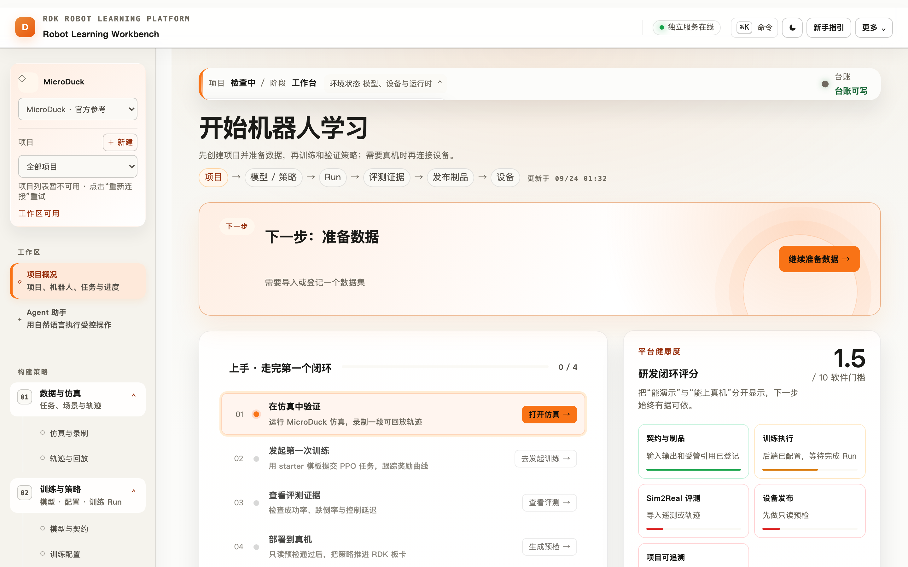
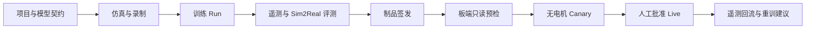
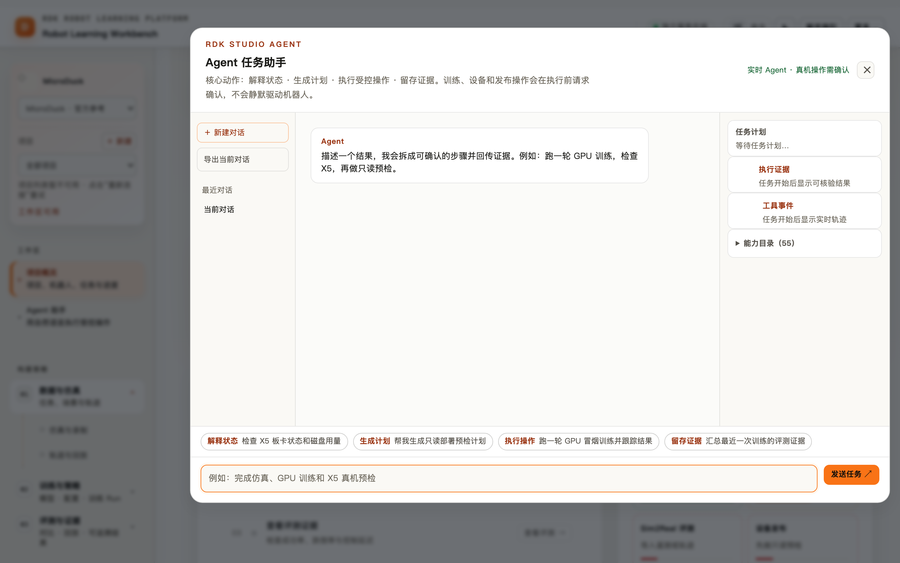
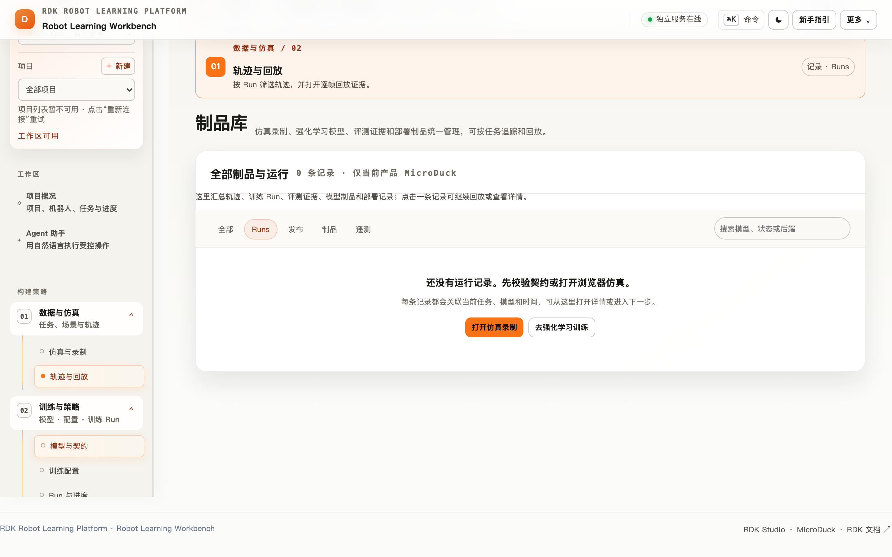
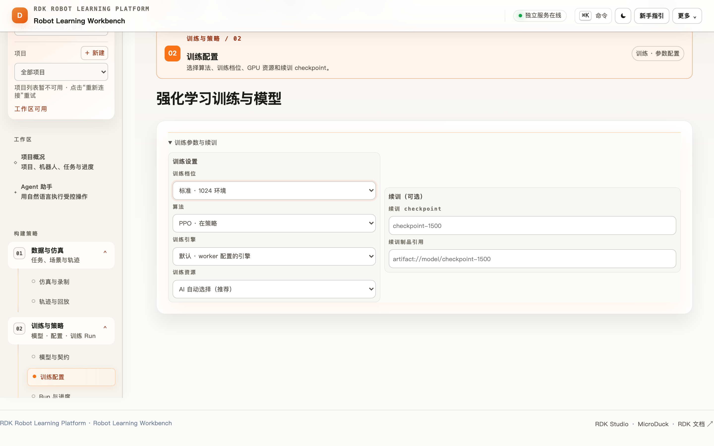
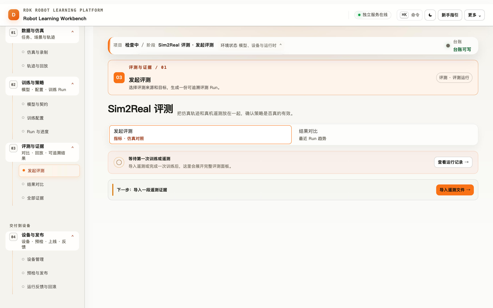
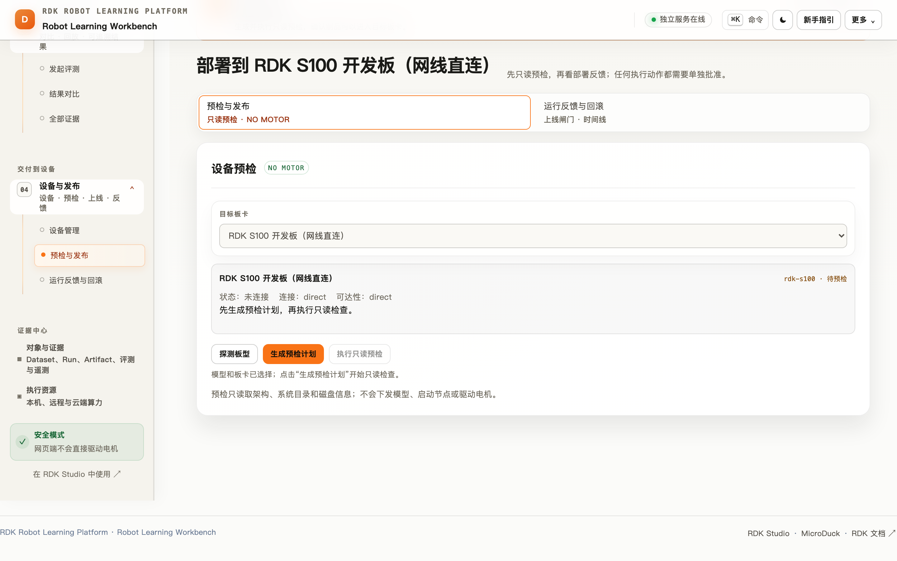
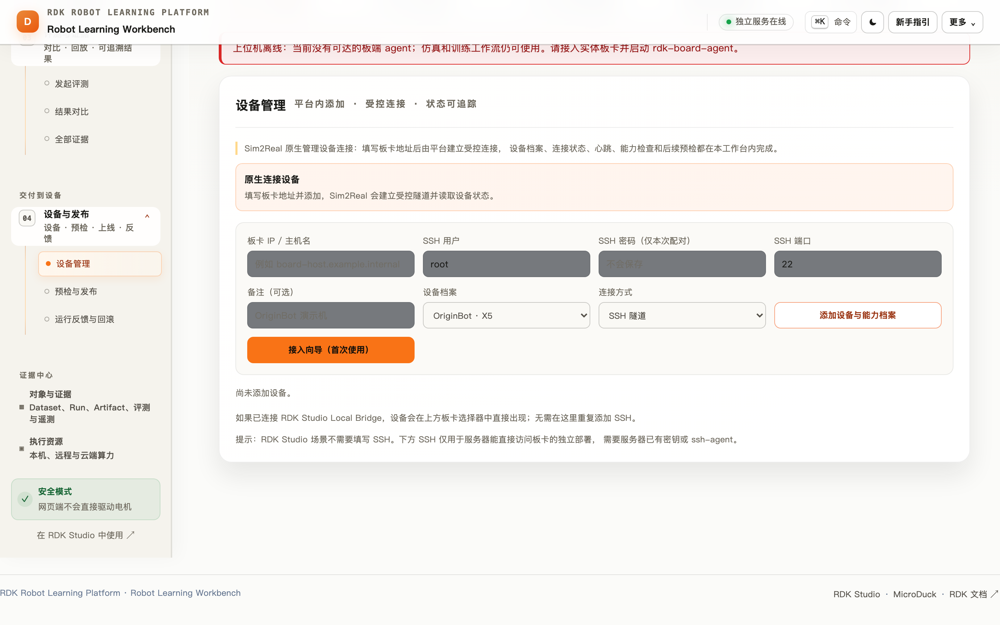
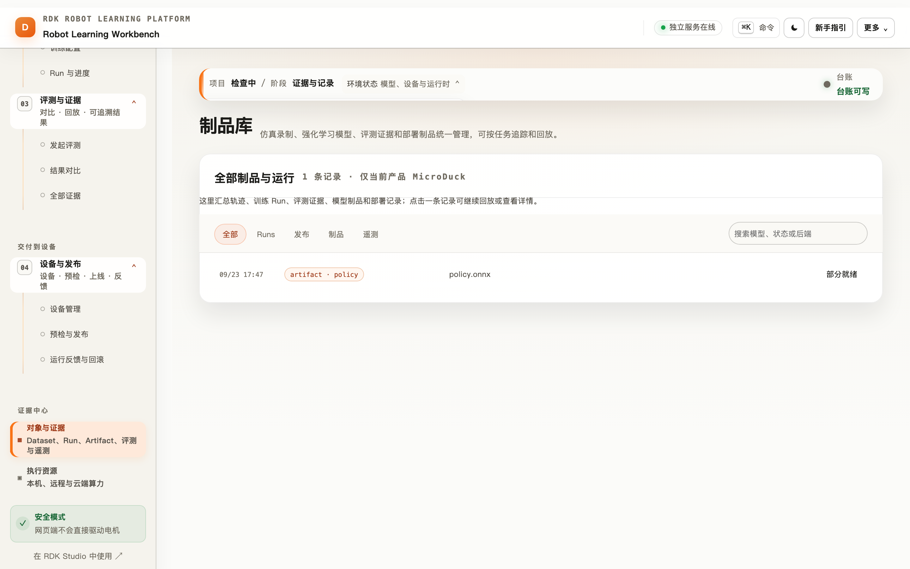

# RDK Robot Learning Platform 全功能产品手册与最佳实践

> 面向开发者、算法工程师、机器人工程师、评估人员和项目评审者的完整使用手册。  
> 本手册以仓库当前代码和可见界面为准，覆盖浏览器工作台、训练执行、评测证据、X5 设备、Agent、MCP 和运维边界。

> **阅读建议**：第一次使用先看“安装、启动和健康检查”与“工作台信息架构”；开发训练重点看“数据与仿真”和“训练与执行资源”；准备上板重点看“制品、发布与 X5 预检”和“设备上位机、遥测和策略运行时”。



*图 1：工作台首页把“仿真 → 训练 → 评测 → 部署”串成一条可追溯工作流。截图来自当前运行界面。*

## 1. 先理解产品

RDK Robot Learning Platform 是一个面向 RDK X5 / S600 / S100 与 MicroDuck、OriginBot、RDK Duck 产品线的机器人学习控制面。它把策略开发拆成可观察、可复现、可审计的阶段：



平台的职责边界很清楚：浏览器负责交互、仿真、录制和回放；服务端负责身份、契约、幂等、配额和证据台账；训练 Worker 或 GPU Runner 执行训练；BoardAgent 负责设备探测、预检、遥测和经过批准的受限执行。网页不会直接连接电机，也不会把 Mock 结果冒充真实训练。

### 1.1 三个产品承诺

| 承诺 | 具体行为 | 验证方法 |
| --- | --- | --- |
| 学得起来 | 浏览器仿真、轨迹录制、Local / Mock / GPU 训练 | 运行 `npm run demo:sim2real` 或 `npm run demo:starter` |
| 信得过 | Run、Artifact、Evaluation、Deployment 形成 lineage，指标缺失保持为空 | 在“对象与证据”查看原始 JSON 与来源 |
| 上得去 | 契约检查、板型预检、Canary、人工批准、急停和看门狗 | `npm run demo:preflight -- --strict` 与现场清单 |

### 1.2 能力状态的正确读法

- **Mock / 合成证据**：验证协议、台账、页面和回放，不产生可部署模型。
- **CPU 真实训练**：starter-ppo、离线 BC、ACT、Diffusion Policy 等可在本地验证；是否能上板仍需目标板制品、遥测和预检。
- **GPU 训练**：通过本机 Agent、远程 SSH Agent 或平台 Runner 接入；网页只持有连接信息和状态，不保存用户 SSH 密码。
- **真机能力**：X5 BoardAgent、真实遥测、BPU/ONNX 制品和受限运动需要部署方设备与现场验收。

## 2. 安装、启动和健康检查

### 2.1 本地开发与演示

```bash
nvm install && nvm use
npm ci
npm run setup
npm run dev:sim2real
```

打开 `http://127.0.0.1:18102`。想要隔离的演示数据，使用：

```bash
npm run demo:sim2real
# 浏览器打开启动器打印的 http://127.0.0.1:18102/?demo=1
```

`?demo=1` 固定 MicroDuck 和行走任务，并预置一台 `x5-demo` 参考设备。退出启动器后临时台账会清理，不污染日常开发记录。

### 2.2 运行前检查

```bash
npm run doctor
curl -s http://127.0.0.1:18102/healthz
curl -s http://127.0.0.1:18102/readyz
npm run demo:preflight
```

`healthz` 关注进程、台账和依赖是否可读写；`readyz` 关注模型资源、认证和设备 adapter 是否达到当前部署要求。演示阶段允许 reference agent 降级；正式演示或发布使用 `--strict`，Mock 会以非零状态阻断。

### 2.3 线上环境

线上站点使用 RDK Studio SSO。登录后确认顶栏账号、工作区和服务连接均为就绪；如果页面提示“需要登录”，使用 SSO 卡片重新登录，再回到 `/sim2real/`。服务端应由 systemd 管理，台账目录使用绝对路径，反向代理只发布工作台和健康探针。

## 3. 工作台信息架构



*图 2：Agent 面板把自然语言请求拆成计划、工具事件和执行证据。训练、设备和发布动作在执行前会请求确认。*

左侧导航按用户意图分成四组，共 8 个视图：

| 分组 | 视图 | 主要功能 | 核心产出 |
| --- | --- | --- | --- |
| 工作区 | 项目概况 | 项目上下文、闭环进度、服务状态、下一步 | 当前工作流状态 |
| 工作区 | Agent 助手 | 解释状态、生成计划、执行受控工具、留证 | 计划与执行证据 |
| 构建策略 | 数据与仿真 | MicroDuck / OriginBot 仿真、动作任务、录制 | JSON / JSONL 轨迹 |
| 构建策略 | 训练与策略 | Manifest、契约、引擎、超参、Run | Checkpoint / ONNX / Run |
| 交付到设备 | 评测与证据 | 遥测导入、回放、指标、仿真/真机对比 | Evaluation |
| 交付到设备 | 设备与发布 | 设备发现、预检、签发、Canary、Live | Deployment / Preflight |
| 证据中心 | 对象与证据 | Runs、制品、发布、遥测筛选与详情 | 可追溯台账 |
| 证据中心 | 执行资源 | 本机 Agent、远程 GPU、云端 Runner | 资源状态与配额 |

顶栏和状态条显示产品线、项目、模型、任务、目标设备、训练后端和台账健康。页面之间共享这些上下文，减少“在错误产品线或错误板型上操作”的风险。

## 4. 三条产品线与契约

工作台支持三种产品选择，选择器位于侧栏项目卡：

| 产品线 | 浏览器仿真 | 参考契约 | 适合场景 |
| --- | --- | --- | --- |
| MicroDuck | MuJoCo/WASM 场景（需挂载审核过的 bundle） | 61D 观测 → 14D 动作，50Hz | 腿式任务、足球、站立/行走/恢复 |
| OriginBot | 本地适配器与隔离 MuJoCo 场景 | 8D 观测 → 2D 差速动作 | 目标导航、X5 传感器和底盘现场演示 |
| RDK Duck | 需要真实 manifest 或部署方适配器 | 由 manifest 声明 | RDK 自有产品线接入与后续真机验收 |

契约（manifest）至少包含：产品标识、观测顺序和形状、动作顺序和范围、控制频率、运行时分工、目标板型、制品引用和摘要。登记时只保存元数据与校验和，不执行上传的 Python、XML 或 shell。

### 契约最佳实践

1. 修改观测或动作顺序时创建新版本，不覆盖历史版本。
2. 模型名包含任务、环境数、迭代数和日期，例如 `originbot-goalnav-256env-ep500-v3`。
3. 把控制模型（CPU ONNX、单线程）与视觉模型（X5 BPU）分开声明。
4. 目标板型、采样率和动作范围写进 manifest，不依赖口头约定。
5. 普通 ONNX 只代表仿真或本地路径；声称可部署必须附带目标板编译制品、runtime 元数据和板端延迟收据。

## 5. 数据与仿真：从动作到轨迹



*图 3：轨迹按 Run 筛选，支持逐帧回放，后续评测引用同一份证据。*

### 5.1 仿真操作

1. 进入“数据与仿真 → 仿真与录制”。
2. 选择产品线和动作任务，确认状态条里的模型、任务和频率。
3. 打开已挂载的仿真场景，先做短动作验证。
4. 点击开始录制，完成单一目标动作后停止并保存。
5. 在“轨迹与回放”检查时间戳、观测长度、动作范围和 episode 边界。

浏览器仿真需要 WebGL。画布黑屏时先开启硬件加速或切换 Chrome / Edge；数据链路可以先用回放页验证，不要把黑屏误判成训练服务故障。

### 5.2 数据质量门

- 轨迹必须有单调时间戳、完整观测和动作、明确 episode 边界。
- 采样频率应与 manifest 一致（MicroDuck 默认 50Hz）。
- 动作不能超出契约范围；离群帧和跌倒事件要留在数据中，不能悄悄删除。
- 训练集、验证集按 episode 划分，避免同一段连续轨迹泄漏到两侧。
- 真实遥测在绑定 Run 前先本地解析和回放，确认 `source`、时间、板型和 `mock=false`。

## 6. 训练与执行资源



*图 4：训练配置页把模型契约、后端、档位和续训 checkpoint 放在同一张表单中。*

### 6.1 训练后端

| 后端 | 何时使用 | 结论边界 |
| --- | --- | --- |
| Mock worker | 首次验收、无 Python / CUDA | 只验证协议和台账，不生成可部署权重 |
| Local worker | CPU 真实训练、开发调参 | 由当前引擎的验证脚本证明，仍需板端验收 |
| 本机 GPU Agent | 用户自己的 GPU | 浏览器通过 `127.0.0.1` 连接，核心服务不接触本机 GPU |
| 远程 SSH Agent | 独立 GPU 服务器 | SSH 密钥由用户电脑 Agent 使用，不保存 SSH 密码 |
| RoboGo / 平台 Runner | 云端或团队算力 | Token 只在服务端短时使用，状态通过 reconcile 回写 |

### 6.2 引擎选择

| 引擎 | 范式 | 典型入口 | 关键验证 |
| --- | --- | --- | --- |
| starter-ppo / SAC | 在线强化学习 | `npm run demo:starter` | 真训练、ONNX 导出、遥测评测 |
| MJX / dm_control | MuJoCo 接触动力学 | `verify:mjx-adapter` / `verify:dm-control-adapter` | 物理与生态 API |
| visual-ppo | 像素观测 RL | `verify:vision-observation` | JAX 与 ONNX 数值等价 |
| offline-bc | 离线行为克隆 | `npm run train:offline-bc` | train/val、ONNX 等价 |
| ACT | Transformer + CVAE 动作分块 | `npm run train:act` | episode 划分、时序集成、ONNX |
| Diffusion Policy | DDPM 动作分块 | `npm run train:diffusion-policy` | 去噪循环 ONNX 化 |
| SmolVLA | VLA 参考适配 | `verify:smolvla` | CPU dry-run；完整微调需 CUDA |
| MicroDuck 任务族 | 腿式、足球、循环策略 | 对应 `verify:microduck-*` | 61D→14D 契约与安全运行时 |

### 6.3 训练提交与续训

1. 选择已登记模型和目标资源。
2. 先选择 `smoke` 档，确认契约、队列和台账都正常。
3. 再选择 `low-vram`、`standard` 或 `high-vram`，只改变一个关键变量。
4. 需要调参时指定明确的 `resumeFrom.checkpointId`，不要凭名称猜 checkpoint。
5. 观察 `queued → running → completed/failed`；网络断开时先执行 reconcile，不要立即重复提交。

训练 Run 的 `mock`、`deployable`、`metrics` 和 artifact 引用必须与真实执行一致。 `completed` 只表示 worker 完成，不自动代表质量门通过。

### 6.4 GPU 资源最佳实践

- 单 GPU 主机初始并发设为 1，确认显存和数据吞吐后再提高。
- 远程 Runner 固定 Node/Python/CUDA/驱动版本，资源卡记录镜像或环境指纹。
- Token 不放 URL、浏览器 localStorage 或日志；使用短期 token 和最小权限。
- 资源离线时停止提交新 Run，保留已有 Run 的状态，恢复后用 reconcile 补齐。
- 训练文件和 checkpoint 放对象存储或独立目录，不把大文件塞进 JSON ledger。

## 7. Sim2Real 评测与证据中心



*图 5：评测页同时展示契约状态、遥测来源、回放时间线和仿真/真机对比。*

### 7.1 评测流程

1. 在“评测与证据 → 发起评测”选择 Run 和模型制品。
2. 导入 X5 BoardAgent 或浏览器录制的 JSONL；文件在浏览器先本地解析，不会因为选择文件就自动上传。
3. 检查采样率、观测/动作维度、奖励曲线、跌倒事件和资源占用。
4. 点击“上传到当前 Run 并评测”，服务端分块写入并生成 Evaluation。
5. 查看 `actionMAE`、成功率、跌倒率、控制延迟和置信界；缺失数据保持 `—`。

### 7.2 证据分级

`demo-fixture / mock` 只能演示页面和流程；`source=uploaded` 表示用户上传但尚未验证；训练 worker 指标和 attested replay 才能作为真实评测依据。合成证据永远不能解锁发布闸门。

### 7.3 评测最佳实践

- 仿真和真机使用同一任务 ID、动作定义和成功判据。
- 报告记录模型摘要、manifest 版本、固件、板型、采样时间和环境变量。
- 对外报告只引用真实 worker 或 attested replay；不要用默认值填充空指标。
- 评测失败先检查数据质量和契约，不要先改质量门阈值。
- 使用对象与证据页保存原始 JSON，图表只是摘要，不能替代原始证据。

## 8. 制品、发布与 X5 预检



*图 6：部署页把板型、制品、评测和预检结果放在发布闸门前。*

### 8.1 四道闸门

1. **契约通过**：观测、动作、频率、运行时和板型一致。
2. **评测与预检通过**：真实指标、目标设备、工具链、磁盘和 runtime 均满足要求。
3. **无电机 Canary**：安装和加载路径正确，先观察日志和推理时序。
4. **人工批准 Live**：现场有人、急停可用、回滚版本已准备。

### 8.2 只读预检

预检读取板卡 passport、架构、系统目录、磁盘、策略目录、runtime 和设备能力；不上传模型、不启动节点、不驱动电机。预检失败必须修复失败项后重跑，不绕过或手工改台账。

典型真机准备：

```bash
RDK_X5_SSH_TARGET="root@<board-host>" ./scripts/install-x5-board-agent.sh
RDK_X5_SSH_TARGET="root@<board-host>" ./scripts/deploy-x5-board-agent.sh
npm run demo:preflight -- --strict
```

### 8.3 安全红线

- 平台驱动开关、板端驱动开关、策略运行开关默认全部关闭。
- 速度和角速度双重钳制；底盘命令 500ms 无刷新自动归零。
- 空格键急停和板端急停必须在所有视图可用。
- 运动金丝雀使用时间盒，单次命令短、低速、可回退。
- 任何急停、看门狗、传感器陈旧或维度不匹配都 fail-closed。

## 9. 设备上位机、遥测和策略运行时



*图 7：上位机视图展示板卡心跳、电源、IMU、里程计、相机和受限运行时状态。*

设备上位机通过服务端认证代理读取 BoardAgent，浏览器不直连板端。常见只读能力包括：CPU/内存/磁盘、网络速率、运行时长、ROS/TROS 话题、MJPEG 相机和串流日志。

策略运行时路径是“训练 → 导出 → 上传 `policies/` → 维度校验 → 加载 ONNX → 观测槽位检查 → 人工确认 → 受限启动 → 推理统计 → 停止”。观测槽位要标明真实传感器、适配数据和零填充；部分真实输入不能描述成完整 sim2real 对齐。

## 10. Agent 助手与 MCP

### 10.1 内置 Agent

Agent 能解释当前状态、生成训练/评测/预检计划、调用受控工具、显示执行证据。执行方式包括完整、最快和只读；训练、设备、发布相关动作会在执行前等待确认。适合用自然语言询问“为什么这次不能上板”，不适合绕过页面闸门。

### 10.2 外部 Agent（MCP）

```bash
# 终端 1
npm run dev:sim2real
# 终端 2
npm run dev:mcp
```

MCP 通过 stdio 暴露仿真、训练、评测、制品、设备和部署工具；幂等、配额、权限、审批和运动安全仍由 `/api/v1/duck` 服务端执行。客户端配置、认证边界和工具目录见 [MCP 适配层](../duck-lab-mcp.md)。

主链路读取建议优先使用 `rdk_golden_path`：它按项目、模型和任务过滤，返回从数据/任务、训练 Run、制品、评测到 RDK 反馈的当前进度，适合作为外部 Agent 的第一步盘点工具。它是只读能力，不会创建 Run、修改台账或触发设备动作。

外部 Agent 最佳实践：先调用读取工具获取上下文，再生成计划，最后一次性提交经过确认的写操作；保存返回的 Run ID 和幂等键；遇到超时查询状态，不重复创建任务。

## 11. 对象、证据和审计



*图 8：证据中心把 Dataset、Run、Artifact、Evaluation、Deployment 和 Telemetry 放在同一条查询路径。*

推荐的血缘关系：

```text
Dataset → Training Run → Artifact → Evaluation → Deployment
   └────────────── Telemetry / Replay ──────────────┘
```

每次发布至少能回答：用了哪份数据、哪个 manifest、哪次 Run、什么摘要、在哪块板、谁批准、预检为何通过、如何回滚。失败记录和 outcome unknown 必须保留，不能用删除来“清理”历史。

## 12. 运维、容量和故障排查

### 12.1 单实例边界

默认 JSON ledger 适合本机、单写实例和演示。启动第二个服务实例必须设置独立 `RDK_SIM2REAL_STORAGE_DIR`；生产多副本需要 PostgreSQL、对象存储、分布式锁和独立配额服务，不能只安装数据库就宣称完成迁移。

### 12.2 故障排查顺序

1. 看顶栏连接状态，刷新一次。
2. 请求 `/healthz` 和 `/readyz`，确认进程、台账、认证和 agent。
3. 打开对应 Run / Deployment 详情，读失败原因和原始 JSON。
4. 检查 manifest、artifact 摘要、板型 passport、agent 心跳和时间戳。
5. 外部训练超时先 reconcile；确认没有活动任务后再重试。
6. 修复后只重跑当前阶段，并确认新记录引用旧记录而非覆盖。

### 12.3 发布前检查

```bash
npm run format:check
npm run verify:ui
npm run verify:api-contract
npm run smoke:sim2real-local
npm test
```

发布前再运行完整 `npm run verify`，并附上真实板端、遥测和回滚证据。命令退出码和实际输出比“启动过”更重要。

## 13. 一次完整交付的验收清单

- [ ] 项目、产品线、任务、模型和目标设备上下文正确。
- [ ] Manifest 校验通过并登记版本。
- [ ] 仿真轨迹可回放，频率、维度和 episode 边界正确。
- [ ] 训练 Run 标明真实 / Mock、后端、指标和制品引用。
- [ ] 评测遥测绑定到具体 Run，来源和 `mock` 状态可追溯。
- [ ] Artifact 摘要、目标板型和 runtime 元数据一致。
- [ ] X5 只读预检通过，失败项有修复记录。
- [ ] 无电机 Canary 日志干净，watchdog 和急停实测可用。
- [ ] Live 有人工批准、时间盒、现场人员和回滚版本。
- [ ] 运行后遥测回流到 Run，记录页能够复原全过程。

## 14. 相关资料

- [产品指南](../product-guide.md)：8 个视图的截图导览。
- [使用手册与最佳实践](../user-guide.md)：面向日常操作的快速版本。
- [首次启动](../first-run.md)：安装、板端和生产部署入口。
- [演示脚本](../demo-runbook.md)：90 秒演示和真实训练边界。
- [MCP 适配层](../duck-lab-mcp.md)：外部 Agent 接入。
- [上位机](../host-station.md) 与 [受限驱动](../actuator-drive.md)：设备和运动安全。
