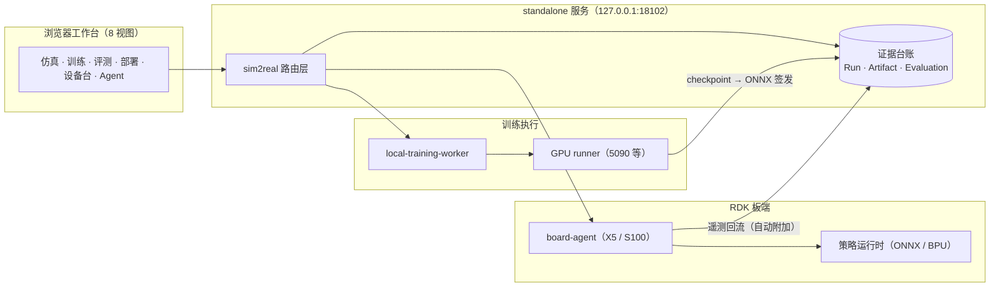
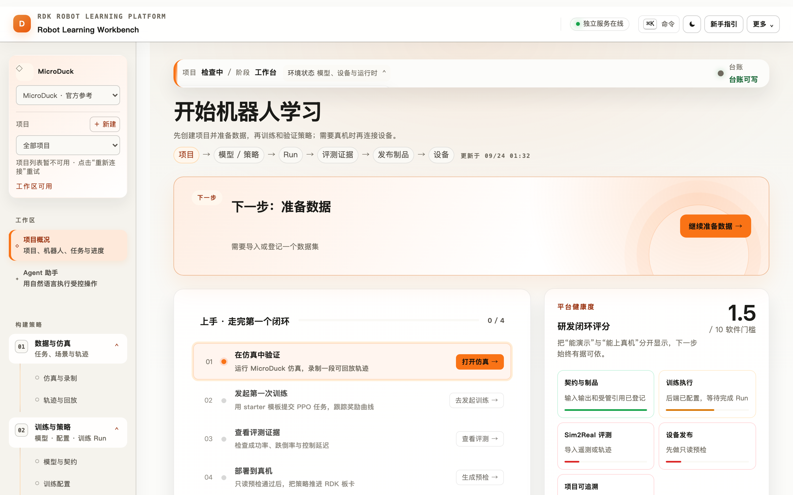
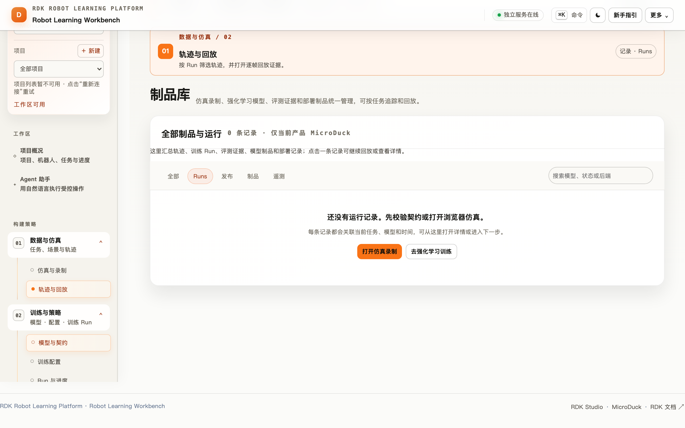
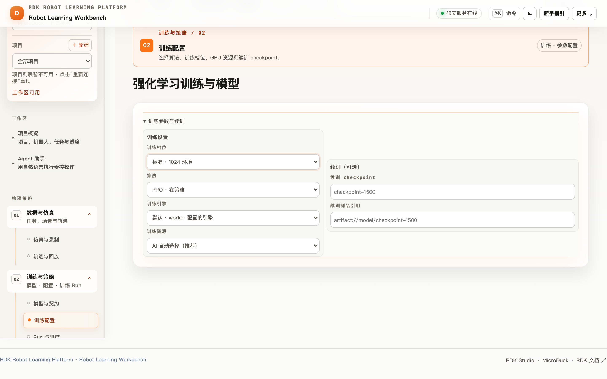
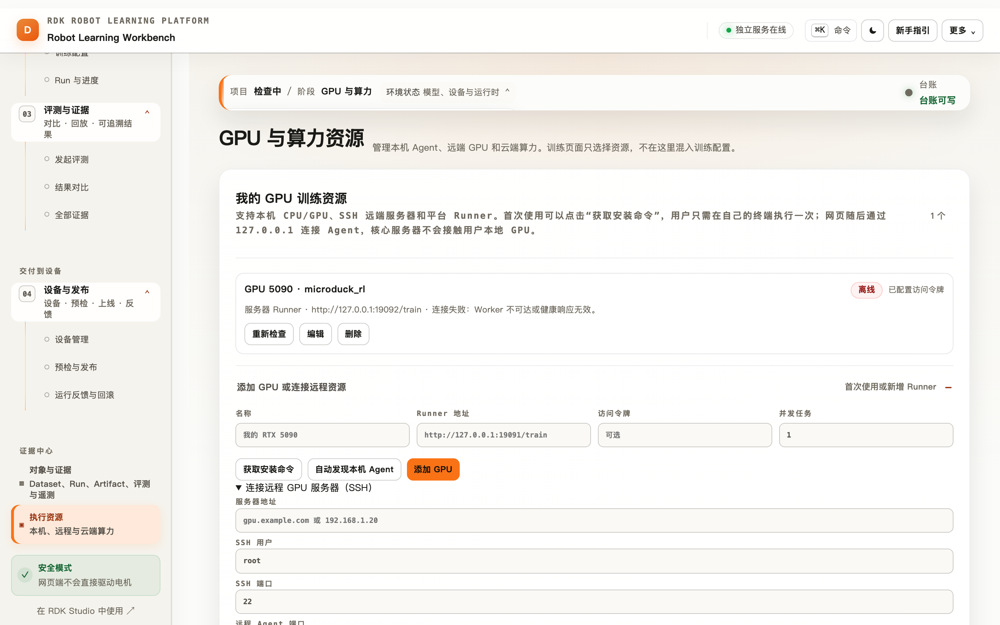
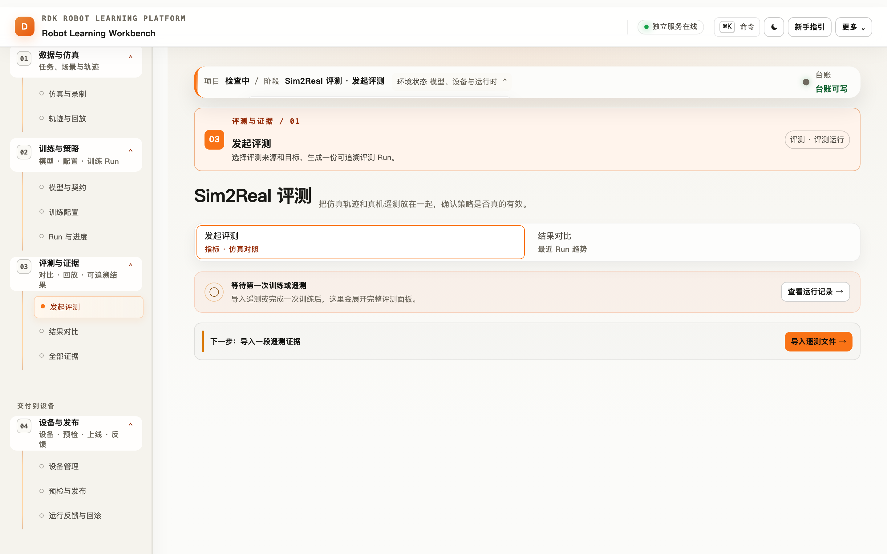
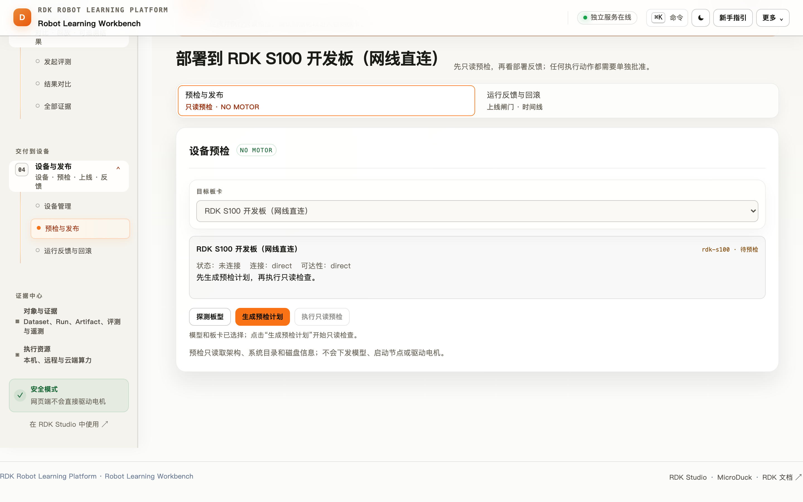
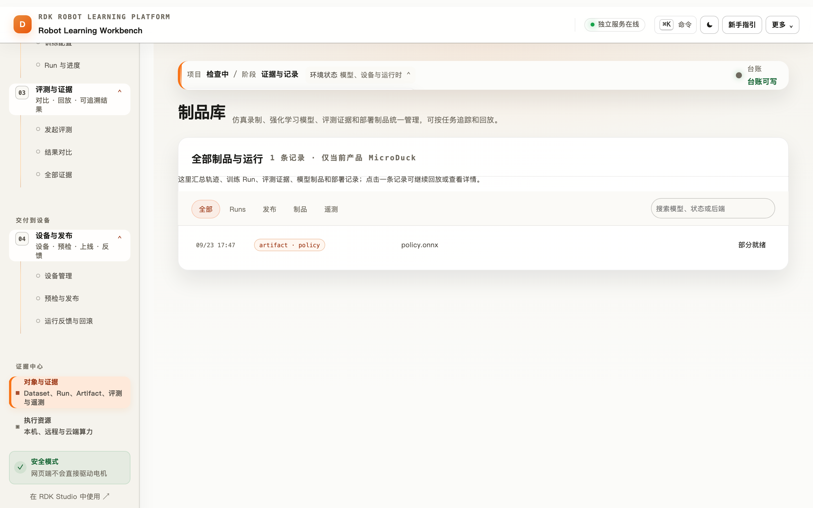
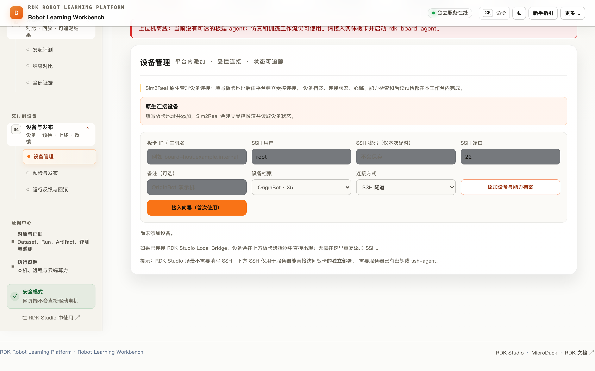
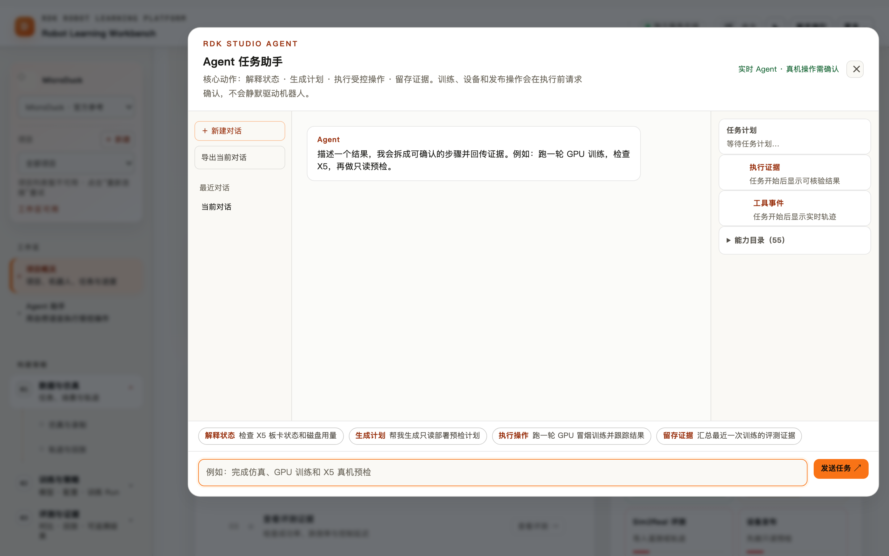

# RDK Robot Learning Platform · 产品手册

> 面向 RDK 设备（X5 / S600 / S100）× MicroDuck 机器人的**机器人学习工作台**：
> 浏览器里完成 仿真 → 录制 → 训练 → 评测 → 签发 → 受控部署 → 遥测回流 的完整闭环，
> 每一步都留下可核验的证据。本文档面向第一次接触本平台的用户，10 分钟上手主链路。


## 一、平台是什么

一句话：**一个跑在浏览器里的机器人策略工作台 + 一条上真机前的安全交付链。**

它解决三件事：

1. **学得起来**——不需要配本地 Python 环境，打开浏览器就能跑 MicroDuck 仿真、
   录制轨迹、提交强化学习/模仿学习训练；
2. **信得过**——每次训练产生 Run 台账、每个模型有带 SHA256 的签发制品、每次
   评测有统计置信度门禁，`mock` 与真实数据永远分开标注；
3. **上得去**——部署前强制板卡只读预检、延迟彩排收据、人工审批；真机运动有
   三重开关、速度钳制、500ms 看门狗与常驻急停。

### 平台架构总览



## 二、30 秒上手

```bash
npm ci                        # 安装依赖
npm run dev:sim2real          # 启动本地 standalone 服务
# 浏览器打开 http://127.0.0.1:18102
```

服务健康检查：`GET /healthz`（进程与台账可写）、`GET /readyz`（模型挂载与设备状态）。
偏好命令行验收可跑 `npm run demo:preflight`（全部只读检查，`--strict` 拒绝 mock）。

## 三、工作台导览（8 个视图）

左侧导航按「构建策略 → 交付到设备 → 证据中心」组织，对应真实的研发顺序：

| 视图 | 职责 | 你在这里做什么 |
| --- | --- | --- |
| 项目概况 | 工作区首页 | 看闭环评分、下一步提示、最近运行与部署状态 |
| 仿真与录制 / 轨迹与回放 | 数据与仿真 | 跑 MicroDuck 场景，录制可回放轨迹 |
| 模型与契约 / 训练配置 / Run 与进度 | 训练与策略 | 选引擎与超参，提交训练，盯奖励曲线与日志流 |
| 发起评测 / 结果对比 | 评测与证据 | 用真机遥测或轨迹生成 Sim2Real 评测证据 |
| 设备管理 | 设备台 | 板卡发现、预检、策略下发与上板会话 |
| 预检与发布 | 部署 | 只读预检 → 签发制品 → canary/live 计划与人工审批 |
| 对象与证据 | 证据中心 | Dataset / Run / Artifact / 评测 / 遥测 全量台账 |
| 执行资源 | 算力 | 本机、远程与 GPU runner 的注册与状态 |

### 工作台首页

首页把「能演示」与「能上真机」分开评分，并常驻一张四步上手卡（仿真 → 训练 →
评测 → 部署），做完一步点亮一步。



### 轨迹与回放

录制产物按数据集组织，可逐帧回放——训练、评测和部署都从这份证据继续。



### 训练配置

引擎、超参与预算在这一页声明；提交后生成 Run 台账，进度页有奖励曲线和
stdout 日志流。



### 执行资源

本机 CPU、远程 GPU runner 在此注册；训练任务按资源池调度。



### 发起评测

选择一个 Run 的制品与一份真机遥测（自动附加或手动导入），生成带置信度的
Sim2Real 评测证据。



### 预检与发布

发布前强制只读预检（板卡可达性、工具链、策略维度）；通过后生成签发制品与
canary/live 计划，真机执行还需人工审批。



### 对象与证据（证据中心）

Dataset、Run、Artifact、Evaluation、Telemetry 五类对象全量可查，跨对象引用
构成可追溯链。



### 设备管理（设备控制台）

板卡在线状态、策略下发、上板会话（含模型指纹与推理统计）在此管理。



## 四、手把手：走完第一个闭环

平台把主链路拆成四步，跟着首页的上手卡走即可。

### 第 1 步：在仿真中验证

1. 侧栏「数据与仿真 → 仿真与录制」；
2. 选择任务与模型（默认 MicroDuck 官方参考），点「运行」；
3. 观察动作与实时状态，满意后「录制」一段轨迹并保存。

> 仿真场景需要 WebGL；如果画布黑屏，确认浏览器开启了硬件加速，
> 或换 Chrome / Edge。轨迹与回放页不依赖 WebGL，可先验证数据链路。

### 第 2 步：发起第一次训练

1. 侧栏「训练与策略 → 模型与契约」：确认观测/动作契约（MicroDuck 默认
   61 维观测 → 14 维动作 @50Hz）；
2. 「训练配置」：选引擎（新手用 starter 模板 PPO）、设置 epochs/lr/batch；
3. 「Run 与进度」提交。进度页实时显示奖励曲线与引擎日志；
4. GPU 训练在「执行资源」注册 runner 后自动走远程（体验更好的档位）。

### 第 3 步：查看评测证据

1. Run 完成时，板端/本地遥测会**自动附加**到 Run（无需手动上传）；
2. 「评测与证据 → 发起评测」：选 Run + 遥测，生成评测；
3. 看三个核心指标：`actionMAE`（动作保真）、成功率（带 Wilson 95% 置信
   下界门禁）、跌倒率。指标或置信界缺失 = 评测 FAIL，平台不伪造分数。

### 第 4 步：部署到真机

1. 「设备与发布 → 设备管理」确认板卡在线（X5 / S100）；
2. 「预检与发布」执行**只读预检**（可达性、工具链、维度兼容）；
3. 预检通过 → 签发制品（HMAC-SHA256 + lineage）→ 生成 canary/live 计划；
4. 真机运动前三重安全开关默认全关：现场确认后按顺序打开；
5. 空格键急停永远可用；500ms 底盘看门狗是最终底线。

部署完成后，板端会话（推理统计、模型指纹、停止原因）自动回流到 Run 详情页，
形成闭环证据。

## 五、训练引擎一览

| 引擎 | 范式 | 适用 | 验收命令 |
| --- | --- | --- | --- |
| starter-ppo / SAC | 在线强化学习 | 入门与基线（numpy+torch，可 CPU） | `verify:starter-engine` |
| offline-bc | 离线模仿 | 轨迹直接变策略 | `verify:offline-bc` |
| act | 动作分块模仿（RSS 2023） | 多步操作任务；板端时序集成 ONNX | `verify:act` |
| diffusion-policy | 扩散策略 | 多模态动作分布 | `verify:diffusion-policy` |
| smolvla | VLA 微调（450M） | 语言条件任务；GPU runner 上真实微调已实证 | `verify:smolvla` |
| visual-ppo | 视觉观测 RL（JAX CNN） | 像素输入任务 | `verify:vision-observation` |
| mjlab-rsl-rl / dm_control / mjx 适配器 | 生态接入 | 借用上游仿真栈训练 | `verify:*-adapter` |
| microduck 系（football/recurrent/eval） | 任务族 | 多鸭足球、循环网络、任务级评测 | `verify:microduck-*` |

数据进出生态：`npm run convert:lerobot` 在平台轨迹 JSONL 与 LeRobot
v2.1/v3.0 数据集之间双向转换（多相机数据集用 `--video-key` 点名相机，
`--tabular` 只要状态/动作）。SmolVLA 真微调在 GPU runner 上已完整实证，
见 [engines/smolvla.md](engines/smolvla.md)。

## 六、证据与可追溯

- **台账**：Run → Artifact → Evaluation → Deployment 全链路对象化，跨对象
  引用构成 lineage（「这个制品来自哪次训练、评测了什么、部署到哪块板」）；
- **签发**：制品带 HMAC-SHA256 签名与维度/目标板兼容性元数据，板端落盘前
  逐字节校验哈希；
- **诚实性**：mock 数据永远标注；评测指标缺置信界 = FAIL；部署审批通过
  ≠ 已上板；
- **重训飞轮**：`GET /runs/:id/retraining-advice` 基于真机漂移信号（action-mae、
  done-ratio、stale-observation）给出重训建议，由操作员显式发起，绝不自动训练；
- **相关性度量**：`GET /runs-correlation` 输出仿真指标与真机指标的
  Pearson/Spearman 相关与 MMRV 摘要（SimplerEnv 方法论），作为"仿真是否预测
  真机排序"的横向证据。

## 七、安全红线（任何使用方式都适用）

- 真机运动三重开关（平台策略 / 平台驱动 / 板端驱动）默认全关；
- 速度与角速度钳制 + 500ms 底盘看门狗 + 空格急停永远可用；
- 浏览器永不直连板端，一律走带认证的代理路由；
- 真机运动前必须人工确认在场（UI 确认 + 现场清场）；
- mock / 合成数据永远标注，遥测与指标永不伪造，失败一律 fail-closed。

## 八、Agent 助手

右下角「Agent 对话」打开 Studio Agent：用自然语言执行受控操作
（解释状态、生成计划、跑训练、查板卡、只读预检……55 个能力目录）。
训练、设备与发布操作在执行前会请求确认，**不会静默驱动机器人**；
每个任务回传可核验的执行证据。



## 九、常见问题

| 现象 | 处理 |
| --- | --- |
| `npm run dev:sim2real` 起不来 / 端口占用 | 18102 被旧实例占用：`lsof -i :18102` 找到进程后重启；第二个实例必须设独立 `RDK_SIM2REAL_STORAGE_DIR` |
| 仿真画布黑屏 | WebGL 未启用或被无头环境拦截；开启硬件加速，或先用「轨迹与回放」验证数据链路 |
| 部署页显示预检失败 | 预检是**只读**的诚实检查：看失败项（板卡不可达 / 工具链缺失 / 维度不兼容），逐项处理后重跑，不能跳过 |
| 训练一直在排队 | worker 未启动或 GPU runner 掉线：「执行资源」页看注册状态；远程 runner 需隧道与 token 一致 |
| 板端推理无数据 | 先跑 `npm run demo:preflight`；检查板端 agent 进程、`agent.env` 维度/投影与 ONNX IR 版本 |
| LeRobot 转换器报 pyarrow 缺失 | `python3 -m pip install --user pyarrow`；视频方向另需系统 ffmpeg |

## 十、延伸阅读

- [user-guide.md](user-guide.md) —— 使用手册与最佳实践（操作细节以它为准）
- [first-run.md](first-run.md) —— 首次运行清单
- [demo-runbook.md](demo-runbook.md) —— 演示执行手册（含 `demo:preflight`）
- [roadmap.md](roadmap.md) —— 能力清单、验收标准与路线
- [engines/](engines/) —— 每个训练引擎的契约与实证
- [host-station.md](host-station.md) —— 上位机与板端链路
- [lineage.md](lineage.md) / [dataset-lineage.md](dataset-lineage.md) —— 数据与制品可追溯
