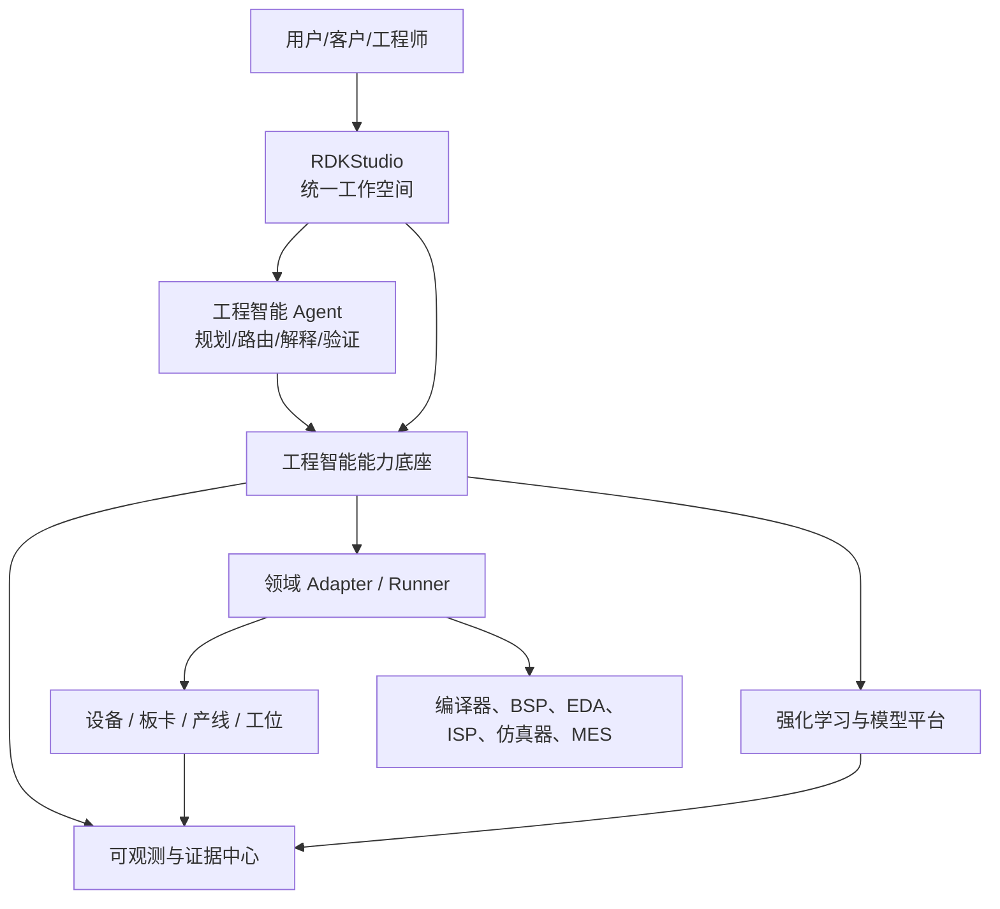

# RDK 工程智能能力底座整体解决方案

**版本**：v0.1（方案基线）  
**适用范围**：RDKStudio、RDK 可观测中心、机器人学习/强化学习平台，以及模型、系统、硬件、媒体和产线工程场景  
**核心目标**：提炼可复用的能力底座和原子能力，通过 Case 编排解决具体工程问题

---

## 1. 执行摘要

当前需求看似分散在模型部署、模型量化、端侧 Runtime、硬件设计、BSP、驱动、多媒体、ISP 和产线测试等领域，实际共享一组工程基础能力：资源管理、能力发现、环境准备、任务执行、数据采集、证据留存、质量判断、制品发布和受控变更。

本方案建议建设 **RDK 工程智能能力底座**，把平台分成四个层次：

1. **RDKStudio**：统一入口、项目空间和 Case 工作台。
2. **工程智能底座**：统一对象、原子能力、工作流、制品、权限、审批和审计。
3. **可观测与证据中心**：统一采集日志、指标、遥测、视频、原始数据、报告和诊断证据。
4. **领域平台与适配器**：强化学习、模型编译、BSP、驱动、媒体、ISP、硬件设计和产线测试等能力。

底座不试图替代所有领域工具，也不把所有问题做成一个大 Agent。每个具体问题都表达为一个 **Case**，Case 由多个原子能力编排而成，并通过统一的输入、输出、证据、质量门和回滚契约完成闭环。

目标闭环如下：

```text
需求 → Case 识别 → 能力发现 → 自动生成计划 → 原子能力执行
     → 过程观测 → 证据归档 → 质量门判断 → 制品/报告
     → 审批 → 发布/部署 → 运行反馈 → 下一轮优化
```

## 2. 需求边界与建设原则

### 2.1 需求分组

图片中的 12 项需求可以归为四条业务主线：

| 主线 | 覆盖需求 | 典型结果 |
|---|---|---|
| 模型到端侧 | 1、2、3 | 模型导入、量化、编译、性能精度报告、Runtime 部署 |
| 环境到设备交付 | 6、7、8、9、12 | 开发环境、Bring-up、驱动、BSP、产线测试 |
| 视觉数据与媒体链路 | 10、11 | 视频 Pipeline、Raw/ISP 调优、吞吐和图像质量 |
| 硬件工程智能化 | 4、5 | 原理图/PCB Review、结构和散热设计建议 |

强化学习平台重点负责训练、数据集、仿真、评测和策略部署；RDKStudio 负责工程入口和流程编排；可观测中心负责事实、证据和诊断。四类主线共享底座，但不共享全部领域算法。

### 2.2 建设原则

- **统一对象，不统一算法**：项目、设备、环境、任务、Run、制品和证据统一；量化、BSP、ISP、热仿真等通过适配器接入。
- **先证据，后结论**：任何“完成、通过、可部署”的结论都必须绑定可复核证据。
- **先只读，后变更**：发现、诊断和报告默认只读；刷写、修改、发布和运动操作必须有策略门和审批。
- **声明式优先**：通过 Manifest、Profile、CaseSpec 描述输入和目标，减少人工复制命令。
- **原子能力可组合**：能力有明确输入输出和副作用，支持重试、幂等、超时和回滚。
- **真实、模拟、受限状态一致**：UI、API、事件和报告使用同一套状态语言。
- **平台与工具解耦**：平台管理生命周期和证据，专业工具保留在 Runner/Adapter 中。

## 3. 目标产品形态

### 3.1 用户看到的产品

RDKStudio 提供统一的工作空间：

```text
项目
 ├─ Case 列表
 ├─ 设备与能力 Passport
 ├─ 环境与工具链
 ├─ 数据与制品
 ├─ Run 与任务进度
 ├─ 报告与质量门
 ├─ 发布与回滚
 └─ 可观测与诊断
```

用户不需要先理解 Runner、BSP、训练引擎或 BoardAgent，只需要选择 Case、目标设备和输入制品，平台根据能力 Passport 生成可执行计划。

### 3.2 平台分工

| 平台 | 职责 | 不承担的职责 |
|---|---|---|
| RDKStudio | 项目空间、Case 工作台、流程编排、环境和设备入口 | 不实现所有领域算法 |
| 工程智能底座 | 对象模型、原子能力、任务执行、制品、证据、权限和策略 | 不替代专业编译器/仿真器 |
| 可观测中心 | 日志、指标、遥测、视频、Trace、报告和诊断 | 不直接决定业务发布权限 |
| 强化学习平台 | 数据集、仿真、训练、策略评测、Sim2Real | 不负责通用 BSP/PCB/产线工具 |
| 领域 Adapter/Runner | 调用编译器、BSP、ISP、EDA、训练器和测试工装 | 不自行管理项目血缘和发布状态 |

## 4. 总体架构



底座内部建议拆成八个服务域：

1. **Identity & Resource**：租户、项目、成员、资产、设备和能力 Passport。
2. **Case & Workflow**：Case 定义、计划生成、任务编排、状态机、重试和取消。
3. **Environment & Runner**：环境 Manifest、资源调度、Runner 注册和执行边界。
4. **Artifact & Release**：制品、版本、哈希、签名、兼容性、发布和回滚。
5. **Evidence & Observability**：事件、日志、指标、遥测、原始数据、报告和证据包。
6. **Quality & Policy**：质量门、规则、审批、风险分级、变更策略和安全门。
7. **Knowledge & Agent**：知识检索、计划生成、工具选择、诊断和建议。
8. **Integration**：GPU Runner、BoardAgent、BSP 构建机、EDA、ISP、MES 和外部系统。

可观测能力采用云边双平面：云端负责项目级治理、历史分析、跨设备比较、质量门和发布决策；机器人端负责实时采集、本地缓存、传感器新鲜度、看门狗和安全停止。云端不可用时，机器人仍能保持基本观测和安全闭环，网络恢复后按启动批次和序号补传数据。

## 5. 统一对象模型

### 5.1 核心对象

| 对象 | 含义 | 关键字段 |
|---|---|---|
| `Project` | 权限、成员和配额边界 | `projectId`, `owner`, `members`, `quota` |
| `Case` | 一次具体工程问题或交付目标 | `caseId`, `type`, `inputs`, `target`, `policy` |
| `Asset` | 模型、数据、板卡、BSP、固件、设计文件等 | `assetId`, `kind`, `version`, `sha256`, `uri` |
| `Device` | 实际板卡、机器人、工位或测试设备 | `deviceId`, `model`, `serial`, `state` |
| `CapabilityPassport` | 设备/环境能做什么 | `board`, `bsp`, `runtime`, `sensors`, `limits` |
| `Environment` | 可复现的软件和工具链环境 | `os`, `sdk`, `compiler`, `dependencies` |
| `Run` | 一次任务执行记录 | `runId`, `status`, `runner`, `startedAt`, `endedAt` |
| `Evidence` | 支撑结论的原始或派生证据 | `evidenceId`, `kind`, `source`, `sha256`, `retention` |
| `QualityGate` | 对结果的自动或人工判定 | `gateId`, `rules`, `result`, `blocking` |
| `Artifact` | 可复用、可发布的不可变制品 | `artifactId`, `type`, `compatibility`, `signature` |
| `Release` | 将制品发布到目标环境的计划 | `releaseId`, `target`, `approval`, `rollback` |

### 5.2 统一血缘

```text
Project
  └─ Case
      ├─ Input Asset / Device / Environment
      ├─ Run
      │   ├─ Logs / Metrics / Telemetry
      │   └─ Evidence
      ├─ Quality Gates
      ├─ Artifact / Report
      └─ Release / Deployment / Rollback
```

任何报告都必须能够反查输入、设备、工具链、执行 Run 和原始证据；任何部署都必须能够反查制品来源和通过的质量门。

## 6. 原子能力体系

### 6.1 原子能力的统一契约

每个原子能力都必须声明：

```yaml
capabilityId: model.benchmark
version: 1.0.0
inputSchema: ...
outputSchema: ...
preconditions:
  - target.capability.runtime contains cpu-onnx
evidence:
  - latency
  - memory
  - accuracy
sideEffect: read-only
permission: case.execute
timeoutSeconds: 1800
idempotencyKey: caseId + inputSha256 + targetId
rollback: none
```

### 6.2 资源与身份原子能力

| 编号 | 原子能力 | 作用 |
|---|---|---|
| RES-001 | 项目上下文解析 | 读取项目、成员、配额和默认目标 |
| RES-002 | 资产注册 | 注册模型、数据、BSP、固件、设计文件和配置 |
| RES-003 | 设备发现 | 发现板卡、机器人、相机、工位和测试设备 |
| RES-004 | 能力 Passport 读取 | 获取芯片、BSP、Runtime、传感器、资源和限制 |
| RES-005 | 版本关系解析 | 建立模型、数据、代码、环境和制品之间的关系 |
| RES-006 | 兼容性判断 | 判断输入资产是否适配目标设备和环境 |

### 6.3 Case 与任务执行原子能力

| 编号 | 原子能力 | 作用 |
|---|---|---|
| JOB-001 | Case 规范化 | 将自然语言需求转换为结构化 CaseSpec |
| JOB-002 | 执行计划生成 | 根据目标和能力 Passport 生成步骤图 |
| JOB-003 | Runner 选择 | 选择本地、GPU、板端、编译机或产线 Runner |
| JOB-004 | 任务提交 | 创建幂等 Run 并提交到 Runner |
| JOB-005 | 进度与状态同步 | 统一 queued/running/blocked/failed/succeeded 状态 |
| JOB-006 | 取消、重试和恢复 | 支持安全取消、失败重试和断点恢复 |
| JOB-007 | 人工审批 | 对高风险步骤执行审批和责任留痕 |
| JOB-008 | 依赖编排 | 按 DAG 编排多步骤任务和条件分支 |

### 6.4 环境与工具链原子能力

| 编号 | 原子能力 | 作用 |
|---|---|---|
| ENV-001 | 环境解析 | 解析 OS、SDK、Python/Node、编译器和依赖版本 |
| ENV-002 | 环境准备 | 安装或复用声明式开发/训练/构建环境 |
| ENV-003 | 环境健康检查 | 检查工具链可用性、版本和资源 |
| ENV-004 | 环境快照 | 固化环境 Manifest、镜像、依赖和校验和 |
| ENV-005 | 工具链注册 | 注册编译器、量化器、仿真器、EDA 和测试工具 |
| ENV-006 | 环境漂移检测 | 比较当前环境与通过验证的基线 |

### 6.5 模型、数据与强化学习原子能力

| 编号 | 原子能力 | 作用 |
|---|---|---|
| ML-001 | 模型导入 | 导入 ONNX、Torch、TensorFlow 或其他受支持格式 |
| ML-002 | 模型契约校验 | 校验输入输出、维度、数据类型和算子约束 |
| ML-003 | 数据集注册 | 注册数据版本、来源、统计、质量和血缘 |
| ML-004 | 训练 Run | 提交本地、GPU、仿真或 RoboGo 训练任务 |
| ML-005 | Benchmark | 在固定设备、数据和环境上测精度与性能 |
| ML-006 | 量化搜索 | 执行量化参数、校准数据和精度回归搜索 |
| ML-007 | 训练评测 | 评测成功率、奖励、泛化、延迟和稳定性 |
| ML-008 | 模型导出 | 导出 ONNX、策略包或其他运行时格式 |
| ML-009 | Sim2Real 对比 | 对比仿真、回放和真实设备遥测 |

### 6.6 设备、系统与 BSP 原子能力

| 编号 | 原子能力 | 作用 |
|---|---|---|
| DEV-001 | 设备连接 | 通过受控 BoardAgent 或设备代理建立连接 |
| DEV-002 | 设备健康检查 | 读取系统、磁盘、温度、传感器和服务状态 |
| DEV-003 | 启动链采集 | 采集串口、Boot、Kernel、服务和启动耗时证据 |
| DEV-004 | 系统 Bring-up 检查 | 按板型清单检查系统、BSP、驱动和基础服务 |
| DEV-005 | 外设能力探测 | 探测相机、IMU、网卡、串口、GPIO 等能力 |
| DEV-006 | 驱动适配测试 | 运行接口契约、功能、稳定性和回归测试 |
| DEV-007 | BSP 构建 | 调用受控 BSP 构建 Runner 生成镜像和报告 |
| DEV-008 | BSP 差异分析 | 比较基线、客户定制和版本升级差异 |
| DEV-009 | 固件/系统刷写 | 在审批和安全门通过后执行刷写 |
| DEV-010 | 设备回滚 | 回滚到最近一个通过质量门的版本 |

### 6.7 Runtime、媒体与 ISP 原子能力

| 编号 | 原子能力 | 作用 |
|---|---|---|
| RT-001 | Runtime 能力解析 | 读取 CPU/BPU/GPU、算子、内存和线程限制 |
| RT-002 | 模型编译 | 将模型转换为目标 Runtime 或 BPU 制品 |
| RT-003 | Runtime 预加载 | 在目标环境加载并做静态校验 |
| RT-004 | 单帧/批量推理 | 执行固定输入的数值和性能测试 |
| RT-005 | 延迟与资源测量 | 采集 P50/P95、CPU/BPU/DDR、温度和功耗 |
| MEDIA-001 | 相机探测 | 获取分辨率、格式、帧率和链路状态 |
| MEDIA-002 | Pipeline 校验 | 验证 Camera/ISP/Codec/Transport 图是否可运行 |
| MEDIA-003 | Raw/视频采集 | 采集可回放、可追溯的原始图像或视频 |
| MEDIA-004 | ISP 参数扫描 | 批量运行参数组合并生成对比结果 |
| MEDIA-005 | 图像质量评估 | 计算清晰度、噪声、动态范围、色彩等指标 |

### 6.8 证据、质量与发布原子能力

| 编号 | 原子能力 | 作用 |
|---|---|---|
| EVD-001 | 日志/指标/遥测采集 | 将过程数据关联到 Case 和 Run |
| EVD-002 | 原始数据归档 | 保存 Raw、视频、设计文件和大体积输出 |
| EVD-003 | 证据摘要 | 计算哈希、统计、时间范围和来源关系 |
| EVD-004 | 报告生成 | 根据模板生成性能、精度、Bring-up 或测试报告 |
| QA-001 | 规则质量门 | 自动判断精度、延迟、资源、温度和通过率 |
| QA-002 | 回归比较 | 与基线版本比较并输出差异 |
| QA-003 | 异常诊断 | 根据日志、指标和历史 Case 生成原因候选 |
| QA-004 | 证据包导出 | 导出可交付、可审计的完整证据包 |
| REL-001 | 制品晋级 | draft → validated → published → deployable |
| REL-002 | 发布计划 | 生成目标、步骤、审批、窗口和回滚策略 |
| REL-003 | 灰度/Canary | 在受限范围内运行并观察质量门 |
| REL-004 | 发布回滚 | 恢复上一个稳定制品并保留事件链 |

### 6.9 Agent 与知识原子能力

| 编号 | 原子能力 | 作用 |
|---|---|---|
| AI-001 | 需求结构化 | 将用户描述提炼为目标、约束、输入和输出 |
| AI-002 | 知识检索 | 检索板型、BSP、工具链、历史 Case 和故障库 |
| AI-003 | 能力路由 | 根据 Passport 选择可用 Runner 和 Adapter |
| AI-004 | 计划解释 | 解释为什么选择某条路径、需要哪些前置条件 |
| AI-005 | 结果总结 | 汇总报告、失败原因、风险和下一步动作 |
| AI-006 | 方案推荐 | 推荐模型、量化参数、环境、驱动或 ISP 参数 |
| AI-007 | 人机协同 | 将需要人工判断的节点转为审批任务 |

## 7. Case 解决方案模板

### 7.1 模型到端侧 Case

覆盖需求 1、2、3。

```text
ML-001 模型导入
 → ML-002 契约校验
 → RES-004 读取目标板 Passport
 → ML-005 Benchmark 基线
 → ML-006 量化搜索
 → RT-002 Runtime 编译
 → RT-004/005 推理和资源测量
 → QA-001/002 精度与性能质量门
 → REL-001 制品晋级
 → REL-002/003 受控发布
```

**输入**：模型、校准数据、目标板、精度下限、延迟/内存上限。  
**输出**：量化模型、Runtime 制品、精度/性能报告、兼容性结论。  
**关键证据**：模型 SHA-256、编译器版本、测试输入、P50/P95 延迟、资源占用、精度变化。  
**阻断条件**：精度低于阈值、算子不支持、内存超限、设备能力不匹配或证据不完整。

### 7.2 环境到设备交付 Case

覆盖需求 6、7、8、9、12。

```text
ENV-001/002 环境解析与准备
 → DEV-001/002 设备连接和健康检查
 → DEV-003/004 启动链与 Bring-up
 → DEV-005 外设探测
 → DEV-006 驱动适配测试
 → DEV-007/008 BSP 构建与差异分析
 → QA-002 回归比较
 → 产线测试配方执行
 → EVD-004 报告与证据包
 → REL-001/004 发布或回滚
```

**输入**：板型、BSP 基线、客户定制项、外设清单、测试配方。  
**输出**：环境快照、Bring-up 报告、驱动/BSP 制品、产线测试结果。  
**关键证据**：启动日志、设备 Passport、接口测试、版本差异、温度/稳定性和工位结果。

### 7.3 视觉数据与媒体链路 Case

覆盖需求 10、11。

```text
MEDIA-001 相机探测
 → MEDIA-002 Pipeline 校验
 → MEDIA-003 Raw/视频采集
 → MEDIA-004 ISP 参数扫描
 → MEDIA-005 图像质量评估
 → RT-005 吞吐/延迟/资源测量
 → QA-001 质量门
 → REL-001 配置制品晋级
```

**输入**：相机、Raw 数据、Pipeline 配置、ISP 参数范围、目标帧率。  
**输出**：Pipeline 配置、ISP 参数、图像质量报告、性能报告。  
**关键证据**：Raw 与参数版本、同步时间戳、对比图片、帧率、端到端延迟和丢帧率。

### 7.4 硬件设计 Review Case

覆盖需求 4、5。

```text
RES-002 文件注册
 → AI-002 历史设计和规则检索
 → 专业解析器提取结构化信息
 → 规则检查 / 仿真 Runner
 → AI-003 风险归类
 → QA-004 评审证据包
 → 人工确认与问题闭环
```

**输入**：原理图、PCB、3D 结构、热数据、设计规则和历史案例。  
**输出**：问题清单、风险等级、修改建议、仿真结果和评审报告。  
**边界**：AI 可以发现问题、解释规则和提出建议；最终设计签核仍由硬件责任人完成。

## 8. 数据与技术架构

### 8.1 存储分层

| 数据类型 | 建议存储 | 说明 |
|---|---|---|
| 结构化对象、状态、权限 | PostgreSQL | Project、Case、Run、制品元数据、质量门和审计 |
| 大文件和不可变制品 | 对象存储 | 模型、固件、BSP、Raw、视频、设计文件和报告 |
| 高频遥测 | 时序数据库或分区表 | 温度、功耗、延迟、传感器和控制状态 |
| 日志与 Trace | 日志检索系统 | 按 `projectId/caseId/runId/deviceId` 查询 |
| 文档和历史经验 | 向量索引 + 结构化索引 | 手册、故障、设计 Review、历史报告 |
| 跨服务事件 | Outbox/消息队列 | 保证 Case、Run、Evidence 和 Release 的可靠投递 |

### 8.2 统一关联字段

所有事件、日志、指标和证据至少携带：

```text
tenantId / projectId / caseId / runId / deviceId / environmentId
assetId / artifactId / requestId / timestamp / schemaVersion
```

### 8.3 关键事件

```text
case.created
case.planned
run.created
run.started
run.progressed
run.failed
evidence.created
quality_gate.evaluated
artifact.created
artifact.promoted
release.approved
release.started
release.rolled_back
device.degraded
```

事件消费者可以包括可观测中心、通知、实验追踪、报表、费用统计和外部工单系统。事件处理必须幂等，失败不能破坏主业务状态。

## 9. AI Agent 方案

### 9.1 Agent 的职责

```text
自然语言需求
  → 需求结构化
  → 检索历史和能力 Passport
  → 生成 CaseSpec
  → 选择原子能力和 Runner
  → 生成执行计划
  → 运行期间解释进度和异常
  → 汇总证据、质量门和建议
```

### 9.2 Agent 不直接拥有的权限

以下操作默认不能由模型自由决定：

- 未审批的 BSP/固件刷写；
- 未验证制品的正式发布；
- 修改生产设备配置；
- 开启运动执行器；
- 删除原始证据或历史版本；
- 绕过质量门或伪造完成状态。

Agent 只能调用已注册、已授权、有输入输出契约的原子能力。高风险原子能力必须返回审批任务，审批通过后才允许执行。

## 10. 质量门与状态语言

所有平台使用统一状态：

`available`、`ready`、`running`、`blocked`、`mock`、`degraded`、`failed`、`succeeded`、`reversible`。

每个质量门至少包含：

```yaml
gateId: runtime.performance.v1
inputs:
  - benchmarkEvidence
rules:
  - latencyP95 <= target.latencyP95
  - memoryPeak <= target.memoryLimit
  - accuracyDrop <= target.maxAccuracyDrop
decision: pass | fail | needs-review
blocking: true
explanation: ...
```

质量门覆盖：契约、环境、功能、精度、延迟、内存、温度、功耗、稳定性、安全、签名、兼容性和回滚验证。

## 11. 与当前仓库的衔接

当前仓库已经具备以下可复用基础：

- `Project → Dataset → Run → Artifact → Evaluation → Deployment` 血缘；
- Local/RoboGo Runner、BoardAgent、硬件适配器和部署预检；
- 结构化日志、Prometheus 指标、遥测评测和发布证据；
- 事件总线与 d-obs 上报插件；
- DSH 能力目录和工具注册机制；
- Board/Profile/Runtime 的契约校验和安全门。

建议的演进不是重写，而是将现有 Sim2Real 控制面扩展为通用工程控制面：

1. 将 `Model` 扩展为通用 `Asset`，支持模型、BSP、固件、设计文件和配置。
2. 新增 `Case`、`Device`、`CapabilityPassport`、`Environment`、`Evidence`、`QualityGate` 和 `Release` 一等对象。
3. 将现有 Runner、BoardAgent 和训练引擎统一包装成原子能力执行器。
4. 将遥测、日志、视频和报告统一挂到 Case/Run 血缘。
5. 将 DSH 能力目录扩展为跨模型、设备、BSP、媒体和产线的能力注册表。

## 12. 分阶段落地路线

可观测与证据中心的数据采集、格式、存储、保留、查询、质量门和迁移细节见[《RDK 工程可观测与证据中心详细设计》](rdk-observability-center-detailed-design.md)。

### P0：底座契约

- 定义 `CaseSpec`、`CapabilitySpec`、`Asset`、`Device`、`Evidence` 和 `QualityGate` Schema。
- 建立统一 ID、事件、状态和错误码。
- 扩展能力注册表和 Runner 接口。
- 统一权限、审批、幂等、审计和证据哈希。

### P1：模型到端侧黄金路径

- 完成需求 1、2、3 的完整闭环。
- 先支持一个目标板型和一类模型。
- 自动产生精度、延迟、内存、功耗和兼容性报告。
- 实现制品晋级、Canary 和回滚。

### P2：环境到设备交付

- 完成需求 6、7、8、9、12。
- 建立设备 Passport、环境 Manifest、Bring-up 清单和测试配方。
- 接入真实 BoardAgent、BSP Runner 和产线工位。

### P3：媒体与 ISP

- 完成需求 10、11。
- 建立 Raw/视频资产、时间同步、回放、ISP 参数扫描和质量指标。
- 将媒体链路性能纳入统一质量门。

### P4：硬件工程扩展

- 接入需求 4、5。
- 建立 EDA/3D/热仿真 Adapter。
- 形成设计 Review 问题库、规则库和签核证据。

## 13. 评估指标

底座是否有效，不能只看 Agent 是否会聊天，应跟踪以下指标：

| 维度 | 指标 |
|---|---|
| 自动化效率 | 人工步骤减少数、Case 完成时长、一次成功率 |
| 可复现性 | 带完整输入/环境/证据的 Run 占比 |
| 诊断能力 | 平均定位时间、自动归因命中率、重复问题下降率 |
| 交付质量 | 质量门拦截率、部署失败率、回滚耗时 |
| 平台复用 | 跨 Case 复用的原子能力数量和调用次数 |
| 设备稳定性 | Bring-up 通过率、驱动回归通过率、产线一次通过率 |
| 模型效果 | 精度保持率、P95 延迟、内存/功耗、端侧成功率 |
| 安全治理 | 未审批变更数、证据缺失发布数、审计完整率 |

## 14. 首批需要形成的交付物

建议先形成以下 10 个正式交付物：

1. 《RDK 工程智能底座对象模型》
2. 《CaseSpec 与 CapabilitySpec Schema》
3. 《原子能力注册和版本管理规范》
4. 《Runner/Adapter 接入规范》
5. 《设备 Capability Passport 规范》
6. 《证据、报告和质量门规范》
7. 《统一事件、日志和关联 ID 规范》
8. 《Agent 工具调用与审批策略》
9. 《模型到端侧 Case 实施方案》
10. 《环境到设备交付 Case 实施方案》

首个工程闭环建议选择 **“开源模型接入 → 量化调优 → Runtime 部署 → 性能精度报告 → 受控发布”**。它能同时验证 RDKStudio、可观测中心、强化学习平台和公共底座，且结果容易用精度、延迟、内存、功耗和发布成功率衡量。

---

## 15. 结论

RDKStudio、可观测中心和强化学习平台不应继续各自扩展成孤立的大平台，而应围绕一套共同的工程对象、原子能力、执行契约和证据链协作。

底座解决通用问题：**谁、对什么资产、在什么环境、用什么能力、执行了什么、产生了什么证据、是否通过质量门、能否发布和回滚**。具体业务通过 Case 组合原子能力解决。这样既能覆盖模型和机器人学习，也能逐步覆盖 BSP、驱动、媒体、ISP、硬件设计和产线测试，同时避免把所有领域知识硬编码进一个系统或一个 Agent。
