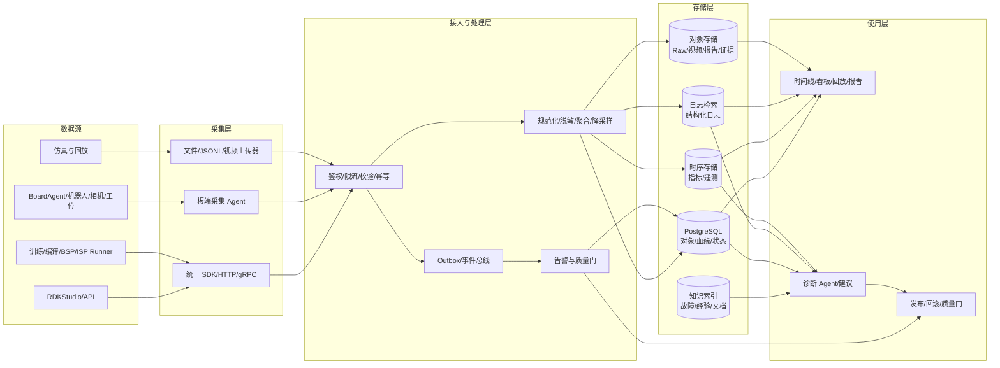

# RDK 工程可观测与证据中心详细设计

**版本**：v0.1  
**关联方案**：[RDK 工程智能能力底座整体解决方案](rdk-engineering-intelligence-foundation-solution.md)

## 1. 目标和边界

可观测中心是 RDK 工程智能底座的事实层和证据层。它负责回答：

```text
谁在什么时间、对什么资产、在什么设备和环境上，执行了什么操作，
产生了什么过程数据和结果，是否通过质量门，下一步是否允许继续。
```

它覆盖五类对象：

1. **平台运行**：RDKStudio、API、Runner、任务队列和 Agent。
2. **工程执行**：模型导入、量化、编译、训练、BSP、驱动、ISP 和产线任务。
3. **设备运行**：板卡、机器人、相机、传感器、工位和测试夹具。
4. **结果证据**：指标、日志、遥测、Raw、视频、报告、质量门和发布记录。
5. **工程知识**：故障、处置、基线、历史 Case 和人工结论。

它不替代专业工具，也不直接拥有所有设备变更权限。专业工具通过 Runner/Adapter 接入，危险操作由策略和审批控制。

## 2. 设计原则

- **统一关联**：每一条日志、指标、遥测和证据都能关联到 Project、Case、Run、Device 和 Artifact。
- **原始数据不被结论覆盖**：原始日志、遥测和输入不可变保存；派生指标可以重算。
- **实时与审计分离**：实时告警追求低延迟，审计证据追求完整和长期可复核。
- **分层存储**：热数据用于查询，温数据用于分析，冷数据用于审计和回放。
- **单位和语义明确**：数值必须带单位、采样频率、时间基准和来源。
- **来源可信**：区分 `board-agent`、`runner`、`browser`、`demo-fixture` 等来源，模拟数据不能解锁生产结论。
- **写入幂等**：设备断网重试、服务重启和重复上报不能制造重复证据。
- **默认最小权限**：采集器只写入被授权的项目和设备，查询遵守租户和项目隔离。
- **状态可解释**：所有告警和质量门都必须包含原因、影响、证据和建议动作。

## 3. 目标架构



## 4. 数据分类和采集策略

### 4.1 数据分类

| 数据类型 | 典型内容 | 是否原始保存 | 主要用途 |
|---|---|---:|---|
| 事件 | Case 创建、Run 状态、制品晋级、发布、回滚 | 是 | 状态机、审计、跨服务联动 |
| 日志 | 服务、Runner、编译器、BSP、驱动、Runtime 输出 | 是 | 检索、故障诊断、审计 |
| 指标 | 延迟、吞吐、CPU/BPU/DDR、温度、功耗、成功率 | 采样保存 | 看板、告警、质量门、趋势 |
| 遥测 | IMU、里程计、电池、相机状态、控制状态 | 是或分片 | 回放、评测、真机证据 |
| Trace | 请求、任务、Runner、设备调用链 | 采样保存 | 跨服务定位耗时和失败点 |
| Raw/视频 | 原始图像、视频、轨迹、测试输入 | 关键样本 | 回放、ISP、视觉和证据 |
| 报告/证据 | 评测报告、编译摘要、质量门、签名清单 | 是 | 交付、发布、追责 |
| 知识 | 故障结论、人工 Review、处置方法 | 是 | 检索、推荐、Agent 诊断 |

### 4.2 采集方式

| 来源 | 推荐方式 | 说明 |
|---|---|---|
| RDKStudio/API | 服务端 SDK + 中间件 | 自动注入 `requestId`、用户、项目和 Case 上下文 |
| 训练/编译/BSP Runner | Runner SDK + stdout/stderr 解析器 | 结构化进度和指标，原始日志同时归档 |
| BoardAgent | gRPC/HTTPS 分片上传 | 支持序号、断点、签名、压缩和离线缓存 |
| 机器人/相机/产线工位 | 板端 Agent 或工位 Agent | 本地缓存，网络恢复后补传 |
| 浏览器仿真 | 浏览器事件 + 服务端上传 | 明确标记 `source=browser` 或 `demo-fixture` |
| 文件和第三方工具 | 受控导入器 | 导入时计算 SHA-256、探测格式和来源 |

采集器只负责采集和初步校验，不在设备端做复杂结论。质量门、异常归因和发布判断在服务端完成，确保规则版本统一。

### 4.3 云端与机器人端双平面观测

可观测能力必须同时存在于云端和机器人端，但两者职责不同：

| 平面 | 主要观测对象 | 主要职责 | 云端不可用时是否继续工作 |
|---|---|---|---|
| 云端观测平面 | 项目、Case、Run、Runner、制品、设备群和跨任务趋势 | 全局查询、历史分析、质量门、告警、报告、发布和回滚 | 不影响机器人本地安全和基础运行 |
| 机器人端观测平面 | 板卡、进程、Runtime、传感器、相机、控制循环和安全状态 | 实时采集、本地诊断、看门狗、急停联动、离线缓存和现场回放 | 必须保持基本观测和安全停止能力 |
| 设备/传感器层 | IMU、里程计、电池、温度、功耗、帧率和执行器反馈 | 提供带时间戳的原始事实 | 继续采样并写入本地队列 |

机器人端不是云端页面的被动数据源，而是一个**具备本地观测闭环的 Edge Observability Agent**。它至少应具备：

1. 本地采集日志、指标、遥测和关键事件；
2. 使用单调时钟、`bootId` 和递增序列号标记数据；
3. 对控制频率、传感器新鲜度、温度、功耗和进程健康做本地判断；
4. 在云端断开时继续缓存、告警和触发安全停止；
5. 网络恢复后按分片、序号和 SHA-256 向云端补传；
6. 接收云端下发的采集策略，但不能接收绕过本地安全门的危险动作。

### 4.4 云边同步协议

云边数据链路采用“实时摘要 + 关键原始数据 + 断点补传”的模式：

```text
机器人端采集
  → 本地有界队列
  → 实时上传摘要和告警
  → 云端返回 ACK/策略
  → 关键窗口上传 Raw/视频/完整日志
  → 断网恢复后按 bootId + sequence 补传
```

上传协议必须支持：

- `deviceId + bootId + sequence` 去重；
- 分片大小、压缩、校验和和重试；
- 服务端 ACK 到具体序号，而不是只 ACK 到请求；
- 设备时间和云端接收时间同时记录；
- 网络不可用时的本地 TTL 和容量上限；
- 优先级队列：安全事件 > 质量门证据 > 普通指标 > 调试日志；
- 设备端证书或签名 attestation；
- 数据新鲜度和丢包率反馈给云端质量门。

云端查询必须显示数据状态：`fresh`、`delayed`、`offline`、`replayed`、`mock` 或 `stale`，不能把最后一次成功上报伪装成当前状态。

### 4.5 云端和机器人端的安全边界

安全相关判断必须在机器人端本地完成：

- 急停；
- 控制循环超时；
- 传感器冻结或数据过期；
- 温度、功耗和电压超限；
- 策略进程崩溃；
- 动作输出超出硬件安全范围。

云端负责策略下发、观测汇总、质量门和发布治理，但云端延迟、断网或服务异常不能导致机器人继续执行不安全动作。云端只能请求“进入受控状态”，不能绕过机器人端的本地门禁。

### 4.6 当前仓库的云边基础

当前仓库已经有云边闭环的组成部分：

- 机器人端 `board-telemetry-node.py` 采集板端话题和状态；
- `board-telemetry-uploader.py` 负责分片上传；
- BoardAgent 提供设备健康和受控接口；
- 服务端接收遥测、做 attestation、回放和评测；
- Run、Artifact、Deployment 与遥测建立了血缘关系。

当前仍需补齐的是统一的 Edge Observability Agent 协议、跨设备存储、离线策略下发、设备群查询、统一日志/指标接入和云边双向告警闭环。

### 4.7 Edge Observability Agent 协议

机器人端 Agent 是云边之间的标准接入点，不让每个设备类型直接对接云端业务 API。Agent 协议分为五类消息：

| 消息 | 方向 | 作用 |
|---|---|---|
| `device.hello` | 边 → 云 | 上报设备身份、启动批次、Agent 版本和能力 Passport 摘要 |
| `device.heartbeat` | 边 → 云 | 上报新鲜度、健康状态、队列积压和连接状态 |
| `observation.batch` | 边 → 云 | 上传日志、指标、遥测和事件分片 |
| `observation.ack` | 云 → 边 | 确认接收序号、拒绝原因和下一次上传窗口 |
| `policy.sync` | 云 → 边 | 下发采集策略、采样频率、保留窗口和告警规则 |
| `command.request` | 云 → 边 | 请求受控诊断或只读动作 |
| `command.result` | 边 → 云 | 返回命令结果、证据引用和审计信息 |

Agent 不直接执行任意命令。`command.request` 必须引用平台已注册的 `capabilityId`，并声明：

```json
{
  "commandId": "cmd-001",
  "capabilityId": "device.health.read",
  "deviceId": "x5-serial-001",
  "requestedBy": "user-001",
  "expiresAt": "2026-09-18T10:00:00Z",
  "sideEffect": "read-only",
  "approvalRef": null,
  "parameters": { "include": ["cpu", "memory", "temperature"] }
}
```

边缘 Agent 必须拒绝：过期命令、未知能力、参数超范围、项目不匹配、签名不通过和违反本地安全策略的请求。

### 4.8 设备注册、身份和能力 Passport

设备接入分为注册、证明、纳管三个阶段：

```text
设备注册 → 证书/密钥证明 → 读取 Passport → 健康检查 → 正式纳管
```

设备注册信息至少包括：

```json
{
  "deviceId": "x5-serial-001",
  "deviceType": "robot",
  "boardFamily": "x5",
  "serialNumber": "SN-001",
  "ownerProjectId": "proj-originbot",
  "agentVersion": "edge-agent-1.2.0",
  "bspVersion": "bsp-2026.09",
  "runtimeVersions": { "bpu": "3.1", "onnx": "1.18" },
  "sensors": ["imu", "odom", "camera"],
  "limits": { "maxLinearMps": 0.2, "maxTemperatureC": 80 },
  "attestation": { "bootId": "boot-001", "keyId": "device-key-001" }
}
```

Passport 必须区分：

- **静态能力**：芯片、接口、传感器、BSP 和 Runtime 支持。
- **动态状态**：当前温度、磁盘、服务、网络、遥测新鲜度和策略会话。
- **证据能力**：哪些字段已被真实设备证明，哪些只是配置声明。

部署和质量门只能使用通过证明的能力，不得仅根据用户填写的型号放行。

### 4.9 离线缓存、补传和冲突处理

边缘 Agent 使用本地 append-only 队列，数据按照优先级分层：

| 优先级 | 数据 | 本地策略 |
|---|---|---|
| P0 | 急停、看门狗、过温、传感器失效 | 永久保留到 ACK，空间不足时禁止覆盖 |
| P1 | 质量门失败、策略会话、部署结果 | 保留到 ACK，延长本地 TTL |
| P2 | 设备健康、性能指标、错误日志 | 有界缓存，按时间清理 |
| P3 | 调试日志、普通采样 | 可降采样或丢弃，但记录丢弃计数 |

补传协议使用：

```text
deviceId + bootId + stream + sequenceStart + sequenceEnd + sha256
```

服务端返回：

```json
{
  "acceptedThrough": 12031,
  "missingRanges": [[12032, 12035]],
  "duplicateRanges": [[12000, 12010]],
  "rejected": [],
  "nextUploadAfterMs": 1000
}
```

出现冲突时：

- 相同序号、相同哈希：视为重复上传，返回成功；
- 相同序号、不同哈希：标记 `sequence_conflict`，冻结该分片的质量门；
- 缺失序号：显示数据不完整，不能生成“完整证据”结论；
- 设备时钟异常：使用单调时钟排序，并标记 `clock_unsynced`。

### 4.10 云边双向告警和策略

告警分为本地安全告警和云端运营告警：

| 告警类型 | 生成位置 | 云端动作 | 边缘动作 |
|---|---|---|---|
| 控制超时、急停、过温 | 机器人端 | 接收事件、通知和归档 | 立即停止或保持停止 |
| 传感器冻结、数据过期 | 机器人端 | 标记 Run/设备 degraded | 降级策略或安全停止 |
| Runner 离线、磁盘不足 | 云端 | 通知、暂停调度 | 继续本地采集 |
| 模型精度或延迟回归 | 云端 | 阻断制品晋级 | 不自动替换当前策略 |
| 遥测积压或补传失败 | 云边双方 | 限速、提高告警级别 | 保留 P0/P1 数据 |

云端可以下发采集策略：

```json
{
  "policyId": "policy-20260918-01",
  "version": 3,
  "expiresAt": "2026-09-19T00:00:00Z",
  "streams": {
    "health": { "sampleHz": 1, "retentionHours": 24 },
    "control": { "sampleHz": 50, "retentionHours": 6 },
    "camera": { "mode": "on-demand", "windowSeconds": 20 }
  },
  "triggers": [
    { "metric": "temperature_c", "operator": ">", "value": 75, "action": "capture_window" }
  ],
  "signature": "..."
}
```

策略必须有过期时间和版本号。云端策略失效时，Agent 回到本地安全默认值，不能停止安全监控。

### 4.11 设备群查询和多租户隔离

设备群查询基于低基数索引和预聚合，不直接扫描所有原始遥测。常用维度包括：

```text
projectId / boardFamily / bspVersion / runtimeVersion
healthState / deploymentState / firmwareChannel / region
```

平台提供：

- 当前在线设备数、离线设备数和数据过期设备数；
- 按板型、BSP、Runtime 和制品版本聚合的失败率；
- 温度、功耗、延迟和重启次数分布；
- 某一制品在不同设备上的质量差异；
- 某一 BSP/驱动版本的回归影响；
- 按项目和责任人的待处理告警。

原始设备序列号、日志正文和视频仍然受项目权限控制，群组看板只显示经过授权的聚合结果。

### 4.12 统一日志、指标和 Trace 接入

服务端和 Runner 采用 OpenTelemetry 兼容的语义模型，边缘遥测使用平台自己的物理量 Schema；两者通过同一个 Context 关联。

```text
Trace
 ├─ API request span
 ├─ Case planner span
 ├─ Runner execution span
 ├─ BoardAgent command span
 └─ Evidence ingest span

Logs/Metrics/Telemetry
 └─ traceId + caseId + runId + deviceId
```

接入规则：

- Trace 用于请求和任务调用链，不把每个高频遥测样本建成 Span；
- 指标名称和标签保持低基数，详细 ID 放入事件和 Evidence；
- 日志用结构化字段，不依赖正则解析作为唯一事实来源；
- Runner 必须同时提供原始日志引用和规范化进度/指标；
- Agent 端日志先脱敏，再按批次上传；
- 采集器自身也要上报 `dropped_count`、`queue_depth`、`upload_latency` 和 `ack_lag`。

### 4.13 SLO、容量和告警路由

可观测中心自身也必须可观测。第一版建议定义：

| SLO | 目标 |
|---|---|
| 实时健康数据新鲜度 | 在线设备 P95 小于 10 秒 |
| 关键安全事件到云端 | P95 小于 5 秒；本地安全动作不依赖云端 |
| 遥测写入成功率 | 非设备故障情况下 ≥ 99.9% |
| 证据 Manifest 可查询 | 写入后 P95 小于 30 秒 |
| 补传完整性 | 网络恢复后 24 小时内完成可补传数据的 99% |
| 查询可用性 | 关键 Case/Run 查询月度可用性 ≥ 99.9% |

告警路由按责任域分发：

```text
安全告警 → 现场值守/机器人负责人
设备告警 → 板卡/BSP/驱动负责人
模型告警 → 算法/模型负责人
平台告警 → RDKStudio/可观测平台运维
数据告警 → 数据和产线负责人
```

每条告警都需要去重键、抑制窗口、升级策略、责任人、Run/Device 链接和关闭原因。

### 4.14 云边部署拓扑

推荐三种部署形态：

| 形态 | 云端 | 机器人端 | 适用场景 |
|---|---|---|---|
| 本地开发 | 本机服务和文件存储 | 模拟设备或开发板 Agent | 单人调试、协议开发 |
| 内网试点 | RDKStudio、数据库、对象存储、日志/时序服务 | 多台板卡和机器人 Agent | 团队研发、现场调试 |
| 生产规模 | 多实例 API、队列、数据库集群、对象存储和告警系统 | 设备群 Agent、边缘网关和工位 Agent | 量产、客户现场和多租户 |

机器人端可通过边缘网关集中出网，但每台设备仍必须保留本地序列、缓存和安全策略。网关只做传输聚合，不能替代设备身份和设备级审计。

### 4.15 云边验收用例

| 用例 | 验证内容 | 通过条件 |
|---|---|---|
| 正常在线 | 心跳、指标、遥测和 ACK | 云端状态 fresh，序号连续 |
| 短时断网 | 本地缓存和恢复补传 | 恢复后无重复、无关键缺口 |
| 长时断网 | 队列上限和优先级丢弃 | P0/P1 保留，丢弃有计数 |
| 云端不可用 | 本地安全和观测 | 急停/看门狗继续工作 |
| 时钟漂移 | 设备/云端双时间 | 单调顺序正确，标记不可信时间 |
| 重启恢复 | 新 bootId 和序号 | 不覆盖旧启动批次 |
| 重复上传 | 幂等和哈希 | 只生成一份事实 |
| 数据冲突 | 相同序号不同内容 | 质量门阻断并生成告警 |
| 策略过期 | 本地默认策略 | 不执行过期采集/命令策略 |
| 恶意命令 | 签名、权限和能力校验 | 设备拒绝并审计 |
| 设备替换 | 新旧序列和制品关系 | 资产血缘不混淆 |
| 设备群查询 | 聚合、权限和新鲜度 | 结果可解释且不泄露跨项目数据 |

## 5. 统一上下文和数据格式

### 5.1 关联上下文

云边线协议的语言无关基线见 [`shared/schemas/rdk-observability.v1.json`](../shared/schemas/rdk-observability.v1.json)；TypeScript 服务端的运行时校验和类型见 [`shared/observability-contracts.ts`](../shared/observability-contracts.ts)。

所有数据都使用以下上下文，缺失字段必须明确为空，不能用随机字符串替代：

```json
{
  "tenantId": "acct-demo",
  "projectId": "proj-originbot",
  "caseId": "case-model-to-edge-001",
  "runId": "run-20260918-0001",
  "deviceId": "x5-serial-001",
  "environmentId": "env-ubuntu24-cuda12",
  "assetId": "model-yolov8n-v3",
  "artifactId": "artifact-bpu-001",
  "requestId": "req-uuid",
  "traceId": "trace-uuid",
  "schemaVersion": "rdk.observability.context.v1"
}
```

### 5.2 统一事件 Envelope

事件用于状态变化和跨服务通知，不能承载大体积数据。大文件使用 `uri` 和 `sha256` 引用。

```json
{
  "eventId": "evt-uuid",
  "eventType": "quality_gate.evaluated",
  "eventVersion": "1.0",
  "occurredAt": "2026-09-18T09:30:00.123Z",
  "producer": "runtime-benchmark-runner",
  "context": { "projectId": "...", "caseId": "...", "runId": "..." },
  "entity": { "kind": "quality_gate", "id": "gate-001" },
  "status": "succeeded",
  "payload": {
    "gateId": "runtime.performance.v1",
    "decision": "pass",
    "evidenceRefs": ["evidence-001"]
  },
  "idempotencyKey": "case-001|run-001|gate-001|v1"
}
```

### 5.3 结构化日志格式

日志必须是 JSON，禁止把 token、Cookie、完整请求体、密码和原始大文件直接写入日志。

```json
{
  "ts": "2026-09-18T09:30:00.123Z",
  "level": "error",
  "service": "bpu-compiler-runner",
  "event": "compile.failed",
  "message": "operator is not supported",
  "context": { "projectId": "...", "caseId": "...", "runId": "..." },
  "device": { "deviceId": "x5-serial-001", "board": "X5" },
  "error": { "code": "runtime_unsupported_operator", "retryable": false },
  "durationMs": 1834,
  "source": "runner",
  "schemaVersion": "rdk.observability.log.v1"
}
```

### 5.4 指标格式

指标名称使用稳定的 namespace 和低基数标签。设备序列号、Run ID 等高基数标识放在上下文或事件中，不直接作为 Prometheus 标签。

```json
{
  "metric": "rdk_runtime_inference_latency_ms",
  "type": "histogram",
  "timestamp": "2026-09-18T09:30:00.123Z",
  "value": 8.4,
  "unit": "ms",
  "temporality": "delta",
  "labels": {
    "service": "board-runtime",
    "board_family": "x5",
    "runtime": "bpu"
  },
  "context": { "projectId": "...", "caseId": "...", "runId": "...", "deviceId": "..." },
  "source": "board-agent",
  "schemaVersion": "rdk.observability.metric.v1"
}
```

指标类型至少支持 `gauge`、`counter`、`histogram` 和 `summary`。所有物理量必须带单位，时间序列必须说明采样频率和时间基准。

### 5.5 遥测样本格式

板端高频遥测建议二进制 protobuf/gRPC 分片上传；JSONL 用于调试、导入和离线回放。两者必须表达相同语义。

```json
{
  "sequence": 12031,
  "sampleTime": "2026-09-18T09:30:00.123Z",
  "sampleMonotonicNs": 887231231231,
  "source": "board-agent",
  "bootId": "boot-20260918-01",
  "signals": {
    "cpuUsage": { "value": 31.2, "unit": "%" },
    "temperature": { "value": 54.8, "unit": "degC" },
    "batteryVoltage": { "value": 11.9, "unit": "V" },
    "linearVelocity": { "value": 0.12, "unit": "m/s" }
  },
  "quality": { "fresh": true, "clockSynced": true },
  "context": { "runId": "...", "deviceId": "..." }
}
```

高频数据必须包含：设备时间、单调时钟、序号、启动批次、来源、质量标志和采样间隔。服务端时间只能作为接收时间，不能替代设备采样时间。

### 5.6 证据 Manifest

证据 Manifest 是长期审计的核心，不应只保存一个报告 URL。

```json
{
  "evidenceId": "evidence-001",
  "kind": "runtime-benchmark",
  "context": { "projectId": "...", "caseId": "...", "runId": "..." },
  "source": { "type": "board-agent", "deviceId": "x5-serial-001", "bootId": "boot-001" },
  "inputs": [
    { "artifactId": "artifact-bpu-001", "sha256": "..." },
    { "environmentId": "env-x5-runtime-3", "sha256": "..." }
  ],
  "files": [
    { "role": "raw-log", "uri": "object://...", "sha256": "...", "bytes": 18322 },
    { "role": "metrics", "uri": "object://...", "sha256": "...", "bytes": 9201 }
  ],
  "measurements": {
    "latencyP95Ms": 9.1,
    "memoryPeakMiB": 182,
    "accuracy": 0.873
  },
  "createdAt": "2026-09-18T09:30:10.123Z",
  "immutable": true,
  "schemaVersion": "rdk.observability.evidence.v1"
}
```

## 6. 存储架构和保留策略

### 6.1 存储分工

| 存储 | 保存内容 | 访问特点 |
|---|---|---|
| PostgreSQL | Project、Case、Run、Device、Artifact、Evidence Manifest、QualityGate、审计索引 | 事务、权限、血缘和状态查询 |
| 时序数据库 | 指标、遥测、设备健康和性能曲线 | 时间范围、聚合、降采样 |
| 日志存储 | 结构化日志和错误事件 | 关键词、字段、时间和上下文检索 |
| 对象存储 | Raw、视频、原始日志、模型、BSP、报告和证据包 | 大文件、不可变、长期归档 |
| 事件总线/Outbox | 状态变化和异步任务 | 解耦、重试、幂等投递 |
| 知识索引 | 故障结论、人工 Review、文档和历史报告 | 语义检索和 Agent 使用 |

PostgreSQL 保存元数据和索引，不保存大体积视频、Raw 或完整遥测正文。时序库和日志系统可以先采用现有部署方能力，平台通过 Adapter 保持存储实现可替换。

### 6.2 热、温、冷数据

| 层级 | 内容 | 建议保留 | 用途 |
|---|---|---:|---|
| 热 | 最近日志、最近指标、活跃 Run、实时设备状态 | 7～30 天 | 看板、告警、现场排障 |
| 温 | 聚合指标、Run 摘要、常用遥测和报告 | 90～365 天 | 趋势、回归、质量分析 |
| 冷 | 原始日志、原始遥测、Raw、视频和完整证据包 | 按项目/合规策略 | 审计、复现、模型和硬件问题追溯 |
| 永久索引 | 制品摘要、质量门结论、发布和回滚事件 | 长期 | 发布追责和版本血缘 |

具体保留时间由项目策略决定，必须同时考虑存储容量、客户合同和数据合规。清理必须产生审计事件，不能静默删除。

### 6.3 降采样和压缩

- 原始设备数据按 Run/设备/启动批次分片，写入对象存储并计算 SHA-256。
- 实时看板使用 1 秒或 10 秒聚合数据。
- 长期趋势保留 1 分钟、5 分钟和 1 小时聚合结果。
- 日志按天压缩，错误和质量门相关日志单独提升保留级别。
- 视频和 Raw 默认保留关键窗口；发生失败、告警或质量门失败时自动标记为证据，延长保留。

## 7. 接入 API 和查询 API

### 7.1 写入接口

建议统一命名空间 `/api/v1/observability`：

| 接口 | 作用 |
|---|---|
| `POST /events` | 写入领域事件，支持批量和幂等键 |
| `POST /logs` | 写入结构化日志或上传原始日志引用 |
| `POST /metrics` | 写入指标，支持批量和时间序列 |
| `POST /telemetry/chunks` | 写入遥测分片，支持序号、压缩、断点和 attestation |
| `POST /evidence/manifests` | 登记证据 Manifest 和文件引用 |
| `POST /artifacts/:id/measurements` | 将性能/质量测量绑定到制品 |
| `POST /ingest/complete` | 确认批次完整并触发质量门 |

### 7.2 查询接口

| 接口 | 作用 |
|---|---|
| `GET /cases/:caseId/timeline` | 查询 Case 全链路时间线 |
| `GET /runs/:runId/observations` | 查询 Run 的日志、指标、遥测和证据 |
| `GET /devices/:deviceId/health` | 查询设备当前状态和历史趋势 |
| `GET /artifacts/:artifactId/evidence` | 查询制品来源、测试和质量门 |
| `GET /metrics/query` | 查询聚合指标，限制高基数过滤 |
| `GET /logs/search` | 按时间、服务、级别、错误码和上下文检索 |
| `GET /evidence/:evidenceId/replay` | 获取可复核回放索引和文件引用 |
| `GET /quality-gates/:gateId` | 查询质量门规则、输入和判定 |

查询结果必须返回 `source`、`freshness`、`mock`、`degraded` 和 `evidenceRefs`，避免把过期或模拟数据展示成实时事实。

## 8. 数据质量、幂等和可靠性

### 8.1 写入校验

写入网关必须校验：

- Schema 版本和必填字段；
- 项目、设备、Run 和制品是否存在且属于当前租户；
- 时间是否在允许窗口内；
- 单位、数值范围和采样频率是否合法；
- 序号是否连续或明确标记丢失；
- `sha256` 是否与实际文件一致；
- 来源是否已注册并具备权限；
- 批次大小、频率、字节数是否超过配额。

### 8.2 幂等键

不同数据使用不同幂等键：

```text
事件：eventId
日志：source + bootId + sequence 或 requestId + eventName
指标：seriesKey + timestamp + sampleId
遥测：deviceId + bootId + sequence
证据：evidenceId 或 runId + evidenceKind + contentSha256
文件：objectSha256
```

重复写入应返回已存在记录，而不是产生第二份事实。内容冲突必须返回明确的 `idempotency_conflict`。

### 8.3 断网和补传

板端和工位 Agent 使用本地有界队列：

```text
采集 → 本地落盘 → 压缩分片 → 上传 → 服务端 ACK → 删除本地副本
```

本地队列达到上限时，优先保留错误、质量门和策略会话数据，并记录丢弃计数。设备不能因为观测上传失败而绕过安全停止。

## 9. 质量门、告警和诊断

### 9.1 告警分层

| 层级 | 例子 | 动作 |
|---|---|---|
| P0 安全 | 急停、看门狗、过温、设备失控 | 立即停止或保持停止，通知责任人 |
| P1 交付 | 制品不兼容、精度不达标、Runtime 崩溃 | 阻断发布，生成诊断任务 |
| P2 运营 | Runner 离线、磁盘不足、遥测过期 | 降级、重试或通知运维 |
| P3 趋势 | 延迟上升、温度漂移、成功率下降 | 生成分析和预防性建议 |

### 9.2 质量门输入

质量门只读取规范化数据和证据，不直接解析任意日志文本。典型质量门包括：

- 模型输入输出契约；
- 精度下降阈值；
- P50/P95/P99 延迟；
- CPU/BPU/DDR/显存峰值；
- 温度和功耗上限；
- 丢帧率、稳定运行时长和重启次数；
- 设备 Passport 与制品兼容性；
- 真机遥测来源和新鲜度；
- 签名、哈希和回滚制品完整性。

### 9.3 诊断输出

每次诊断至少输出：

```json
{
  "diagnosisId": "diag-001",
  "severity": "high",
  "stage": "runtime.compile",
  "rootCauseCandidates": [
    { "code": "unsupported_operator", "confidence": 0.91 }
  ],
  "impact": "artifact blocked from deployment",
  "evidenceRefs": ["evidence-001", "log-bundle-001"],
  "recommendedActions": ["switch_runtime", "replace_operator"],
  "requiresApproval": false,
  "generatedAt": "2026-09-18T09:31:00Z"
}
```

AI 可以提出原因和建议，但质量门的最终判定必须由可版本化的规则完成；AI 结论必须引用证据。

## 10. 安全和权限

- 按租户、项目、设备和 Case 做行级隔离。
- 采集 Token 只允许写入指定项目和数据类型。
- BoardAgent 与工位 Agent 使用短期凭证、TLS/mTLS 或签名上传。
- 日志字段白名单，自动脱敏 Token、Cookie、密码、私钥和完整请求体。
- 原始视频、Raw、设计文件和产线数据按项目权限隔离。
- 查询接口限制跨项目、跨设备和高基数扫描。
- 证据和发布索引不可原地修改；修订必须生成新版本。
- 删除、归档、解密和导出都产生审计事件。
- 可观测链路故障不能解锁危险动作；数据不新鲜时质量门应保持 blocked 或 degraded。

## 11. 页面和使用视图

第一版不追求大量 Dashboard，优先提供四个视图：

1. **Case 时间线**：需求、计划、Run、日志、指标、证据和质量门按时间排列。
2. **设备健康页**：当前健康、遥测新鲜度、温度、功耗、服务和历史趋势。
3. **制品证据页**：制品来源、兼容性、Benchmark、评测、发布和回滚。
4. **诊断工作台**：异常摘要、证据引用、基线差异、推荐动作和审批入口。

所有视图都显示：`真实/模拟`、数据时间、接收时间、来源、是否过期和证据链接。

## 12. 与当前实现的衔接

当前仓库已经有结构化日志、Prometheus 指标、Run 遥测、attestation、JSONL 分片、审计和 d-obs 事件上报。建议按以下顺序演进：

### 12.1 保留并抽象现有接口

- 使用 [`shared/schemas/rdk-observability.v1.json`](../shared/schemas/rdk-observability.v1.json) 作为 Python/C++/TypeScript 共用的线协议基线。
- 使用 [`shared/observability-contracts.ts`](../shared/observability-contracts.ts) 为云侧提供 TypeScript 类型、运行时校验和危险命令审批前置检查。
- 保留 `Sim2RealStore` 作为领域存储接口，增加 `ObservabilityStore`。
- 保留当前遥测 JSONL 导入和回放，增加 protobuf/gRPC 分片适配器。
- 保留现有日志字段白名单和 Prometheus 路由，统一补充 Case/Run/Device 上下文。
- 保留 BoardAgent attestation、序列号和看门狗校验，统一映射到 Evidence Manifest。
- 保留 d-obs reporter，将其改为事件消费者，不让它承担原始数据主存储。

### 12.2 数据迁移

```text
现有 sim2real.json
  → PostgreSQL：Project/Model/Run/Artifact/Evaluation/Deployment

现有 telemetry/*.jsonl
  → 对象存储：原始分片
  → 时序库：可查询指标和聚合样本
  → PostgreSQL：chunk/evidence 索引

现有 audit.ndjson
  → 日志存储：可检索副本
  → PostgreSQL：审计摘要和哈希
```

迁移期间保留双写或导入校验，先保证新旧评测结果一致，再切换默认读取路径。

## 13. 分阶段实施

### P0：统一契约和采集最小闭环

- 定义 Context、Event、Log、Metric、Telemetry、Evidence Schema v1。
- 增加 `caseId/deviceId/environmentId` 并贯穿现有 Run。
- 建立批量写入、幂等、压缩、哈希和配额校验。
- 将现有日志、指标和遥测统一挂到 Case 时间线。
- 增加 Evidence Manifest 和最小证据查询 API。

### P1：统一存储和质量门

- PostgreSQL 生产 Schema 和租户隔离。
- 对象存储接入 Raw、视频、日志和报告。
- 时序存储接入设备指标和性能数据。
- 日志集中检索和按 Run/Device 过滤。
- 模型到端侧和设备 Bring-up 两条路径接入质量门。

### P2：诊断和运行闭环

- 基线比较、异常规则、告警路由和故障案例库。
- 设备离线补传、降采样和冷热分层。
- 诊断 Agent 使用 Evidence 引用生成原因和建议。
- 质量门结果驱动发布、阻断和回滚。

### P3：规模化和领域扩展

- 多实例写入、Outbox、消息队列和对象存储生命周期。
- ISP/视频/产线/硬件设计数据接入。
- 跨项目指标、SLO、容量和成本分析。
- 历史证据和故障经验进入知识索引。

## 14. 验收标准

第一阶段完成的最低标准：

- 任意一次模型 Benchmark 能查询完整 Case 时间线。
- 任意一次板端 Run 能查询设备、制品、启动批次和遥测来源。
- 重复上传不会产生重复 Run、重复证据或重复遥测样本。
- 断网恢复后可以补传，服务端能发现丢失序号。
- 日志、指标和遥测都能按 `caseId/runId/deviceId/artifactId` 关联。
- 质量门能引用原始证据，不能只引用人工填写的结论。
- 模拟数据和过期数据明确标记，不能解锁生产发布。
- 证据文件具有 SHA-256、来源、版本和保留策略。
- 清理和归档产生审计事件。
- 可观测中心不可用时，危险动作默认保持 blocked 或 stopped。

## 15. 推荐的首个端到端示例

以“开源模型部署到 X5”为第一个可观测闭环：

```text
模型导入
 → 模型契约日志
 → 编译 Runner 日志
 → X5 Runtime 能力
 → BPU 推理指标
 → 温度/功耗/DDR 遥测
 → 精度和延迟质量门
 → Evidence Manifest
 → 报告
 → 制品晋级或阻断
```

这个示例同时验证：服务日志、Runner 日志、设备指标、板端遥测、制品血缘、质量门、证据存储、报告生成和发布控制，是最适合用来验证底座的第一条路径。
